# BrailleBlaster User Manual Version 2.1

### February, 2023

```{contents} Table of contents
:depth: 4
```

## Getting Started

Please watch our videos: [Introduction to
BrailleBlaster](https://www.youtube.com/watch?v=AJEbIoO_ybg) and
[Getting Started with
BrailleBlaster](https://www.youtube.com/watch?v=682dbbo6SmU&t=2s)!

### Modifying the View

BrailleBlaster’s customizable interface allows you to adjust the size
and placement of tools to suit your preferences.

#### Changing Font Size

Font Size can be increased or decreased to your preferred text size. Be
aware that increasing or decreasing the font size may change how much
text is shown on the screen in the Print and Braille Views.

To change Font Size either go to View \> Increase Font Size or Decrease
Font Size. You can also use the shortcuts (Ctrl + “+”) to Increase Font
Size OR (Ctrl + “-”) to Decrease Font Size.

#### Modifying Toolbar Icons

The button icons on the toolbar can be displayed or hidden from view.
The size of the icons can also be changed by going to View \> Icon Size.
This gives you the option of having Small, Medium, or Large icons. How
much text is shown in the Print and Braille Views of your document is
also dependent on Icon Size.

To change how the toolbar buttons are displayed:

1.  Go to View \> Toolbar. The buttons that are currently shown on the
    toolbar have checkmarks beside them.
2.  Check or uncheck which grouping of buttons you would like to have
    shown or hidden in the toolbar.  
    **Note:** The default for the toolbar buttons is all groupings are
    shown in the toolbar, except for the View and Math tools.

#### Toggle Views

You can choose to hide or display text views on your screen allowing you
to focus on one view or multiple views.

1.  Go to View \> Toggle Views. This shows which views you have open in
    the main window with check marks beside the following views:

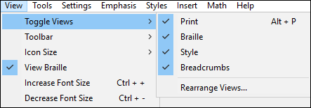

**Print (Alt + P):** Shows the Print text

**Note:** You can only make changes to the text from within the Print
View.

**Braille:** Shows the Braille text  
**Style:** Shows which style is applied to the text.  
**Breadcrumbs:** Shows what styles are applied to sections of the text
in the bottom section of the toolbar. Like a trail of breadcrumbs, it
shows every style used leading up to that specific piece of text.

{{html

<ol>

<li value=2>

Unchecking an item hides the view from the window.

</li>

<li>

Whenever a view is hidden and then displayed it moves to the right-hand
side of the screen.

</li>

</ol>

}}  
**Note:** At least one view must always be displayed.

#### Rearrange Views

BrailleBlaster allows you to arrange the print, braille, and style views
in the order that works best for you.

To arrange the views:

1.  Go to View \> Toggle Views \> Rearrange Views
2.  From here, you can select Move Up or Move Down to switch where each
    view is displayed on the screen.

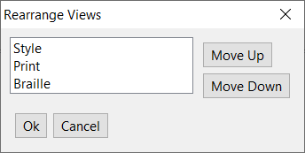

**Note:** The views display from left to right starting with the first
item in the list.

#### Changing Simulated Braille to ASCII

By checking or unchecking View Braille in the main View menu, you can
choose whether you want the text in the Braille View and Braille Preview
to appear as simulated braille or ASCII.


**View Braille Checked**  
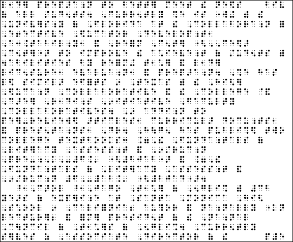

**View Braille Unchecked**  


#### Previewing Your File as an Embossed Braille Document

The Braille Preview displays how the file appears as an embossed BRF.
The braille pages are displayed in 2 Page View mode. This side-by-side
view is like looking at an open-bound book, with the even numbered
braille pages on the left and the odd numbered braille pages on the
right. This allows you to ensure the content is presented correctly in
interpoint documents, such as when certain things need to be on facing
pages or space needs to be allotted for graphics. When viewing
Single-sided materials, 2 Page View can be turned off in Braille Preview
by going to View \> 2 Page View and unchecking it.

To preview a BRF go to File \> Braille Preview OR use the keyboard
shortcut (Alt + Home). This opens the Braille Preview window.

  
**Note:** When you open a BRF in BrailleBlaster it appears in this
Braille Preview window. You cannot edit the BRF, but it can be embossed
by going to File \> Emboss within the Braille Preview menu or using the
keyboard shortcut (Ctrl + E).

Within the Braille Preview, you can navigate through the document by:

- Print Page Number: The page number normally displayed in the top-right
  corner of a braille page.


- Braille Page Number: The page number normally displayed in the
  bottom-right corner of a braille page (including T-Pages and P-Pages).


- Ordinal Page Number: The page number out of the total number of pages
  in your document, regardless of how the print and braille page numbers
  appear.

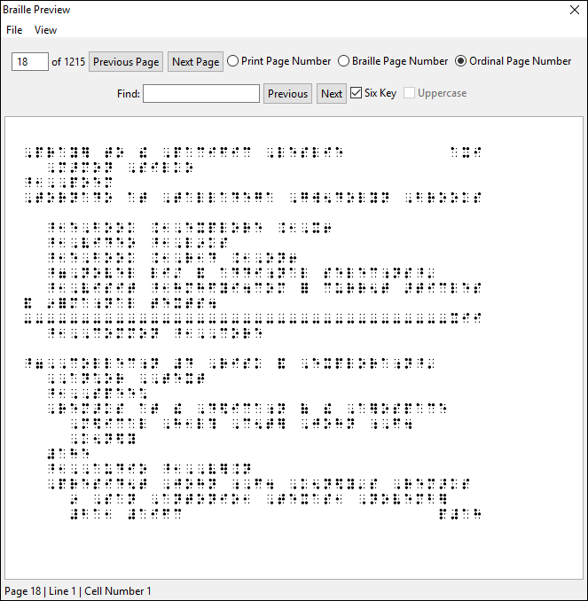

You can also navigate using the Find textbox if you need to find a
specific section in the text. Narrow down your search further with these
two checkboxes:

- Six Key: This checkbox allows a Six Key Input option for searching the
  text. If unchecked, ASCII should be entered to search.
- Uppercase: The uppercase checkbox only becomes available when a BRF is
  loaded into BrailleBlaster. When checked, it takes lowercase ASCII
  that BrailleBlaster produces in the Find textbox and uses it to find
  uppercase ASCII that is in the document. This is important because
  some BRFs use uppercase ASCII to simulate braille while others use
  lowercase ASCII.

Use the Next and Previous buttons to find specific instances of text you
are looking for. When a search reaches the end of the document, it
restarts at the beginning.

The Braille Preview window also has a status line in the lower left
corner that provides navigation help by displaying the page number
(based on your navigation selection), line number, and cell number the
cursor is currently on. This information is accessible to screen
readers.

### Basic File Operations

BrailleBlaster makes creating, opening, and saving files easy through
the use of keyboard shortcuts.

#### Creating Files

When creating a new document, go to File \> New or use the shortcut
(Ctrl + N) to begin working in a new blank tab/page.

##### Pasting Text

You can copy text from another document and paste it into
BrailleBlaster, including special symbols not available on the keyboard.
All of the text automatically formats into the Body Text style (3-1
margins). Add additional formatting and print page numbers to your
document using \[\[#Formatting Styles\|Styles\]\] the \[\[#Adding Print
Page Numbers\|Page\]\] tool.

##### Creating an Original Document

If you are creating a document from scratch, you can type your text
directly into BrailleBlaster. Formatting and editing can be applied as
you create your document.

#### Opening Files 

If you want to open a file in BrailleBlaster or continue working on a
file you have already created, go to File \> Open or use the keyboard
shortcut (Ctrl + O) to open the file.  
BrailleBlaster opens many different types of files. When you select Open
in the File menu, a list of the recognized file types is displayed.

**Note:** LaTeX will be converted into ASCII Math when opened in
BrailleBlaster **except** in NIMAS XML, TXT, BRL, and ZIP file types.

{{html

<ul style="list-style-type:none;">

<li>

BB XML (\*.bbx)

</li>

<li>

BB Archive (\*.bbz)

</li>

<li>

Braille Ready File (\*.brf) **Note:** When BrailleBlaster opens a BRF,
it opens in the \[\[#Previewing Your File as an Embossed Braille
Document\|Braille Preview\]\] window and no changes can be made to the
file.

</li>

<li>

Braille text (\*.brl)

</li>

<li>

Microsoft Word files (\*.docx)

</li>

<li>

EPUB e-books (\*.epub)

</li>

<li>

HTML files (\*.htm or \*.html)

</li>

<li>

Markdown files (\*.md)

</li>

<li>

Open Document files (\*.odt)

</li>

<li>

LaTeX files (\*.tex)

</li>

<li>

Text files (\*.txt)

</li>

<li>

XHTML files (\*.xhtml or \*.xhtm or \*.xht)

</li>

<li>

NIMAS XML files (\*.xml)

</li>

<li>

NIMAS zipped files (\*.zip)

</li>

</ul>

}}

##### Using a NIMAS XML File

Within a NIMAS XML file, some of the print may be automatically
formatted to the correct style for the braille document, such as print
and braille page numbering, designation of headings, identification of
tables, lists, and more. These automatic formats may need to be changed
manually to ensure the print formatting correctly matches the braille
formatting. For example, the headings may appear bold throughout the
print file, but this font attribute is not needed in the braille
transcription. For more information about working with NIMAS files go to
the \[\[#Operations Specific To NIMAS Files\|Operations Specific To
NIMAS Files section\]\].

If your file contains MathML, it is converted to ASCII Math and
translated into your chosen math braille code.

#### Saving Files 

There are several unique file types that BrailleBlaster uses when saving
a file.

**BrailleBlaster ZIP File (BBZ):** BBZ is the default BrailleBlaster
file type. It is a zipped NIMAS file set. When the ZIP file is saved, it
saves as a BBZ. This allows images to remain in the file.

**BrailleBlaster XML File (BBX):** XML stands for eXtensible Markup
Language. BBX was the previous file standard for BrailleBlaster. Now it
saves everything as a BBZ, see below. However, if you have a BBX
document, it should be able to be opened in BrailleBlaster V2. Note that
support for this feature is limited and a very complex BBX file may not
open in V2.

**Braille Ready File (BRF):** BrailleBlaster allows files to be saved as
a BRF. You can also save your file in the Portable Embosser Format
(PEF). These are the file formats that are used to Emboss the document.

**Note:** You cannot edit a BRF or PEF in BrailleBlaster. Make desired
changes before saving as BRF or PEF. You can download BrailleZephyr (a
free and simple BRF editor) to edit BRFs.

To save a BRF or PEF, go to File \> Save BRF/PEF. Selecting this option
saves your entire document as a single BRF or PEF. It opens the Save
window and allows you to name your file.

For more information about BRFs within BrailleBlaster, see
\[\[#Previewing Your File as an Embossed Braille Document\|Previewing
Your File as an Embossed Braille Document\]\].

#### Navigating Files

BrailleBlaster has many tools to help you successfully navigate through
your file. If you are using a NIMAS file, the \[\[#Navigating A NIMAS
File\|Book Tree\]\] is the most useful tool for navigation, but other
tools can be used to navigate any file.

##### Navigating to the Beginning of Your File

Home allows immediate navigation to the beginning of your document.

Go to Navigate \> Home or use the keyboard shortcut (Ctrl + Home). This
places the cursor at the very beginning of the document, before the
first word on the first page.

##### Navigating to the End of Your File

End allows immediate navigation to the end of your document.

Go to Navigate \> End or use the keyboard shortcut (Ctrl + End). This
places the cursor at the end of the file, after the last word on the
last page.

##### Navigating to a Particular Page

Go to Page allows you to navigate to a specific page in your document.
This is helpful for long documents that are difficult to navigate simply
by scrolling. Alternatively, you can also use the \[\[#Finding and
Replacing Text and Styles\|Find and Replace\]\] feature to search your
document if you are looking for a specific word or type of formatting in
your document.

To navigate to a particular page:

1.  Go to Navigate \> Go To Page or use the keyboard shortcut (Ctrl +
    G).
2.  Select the type of page you want to use to navigate:


**Print Page:** The page number normally displayed in the top-right
corner of a braille page.  
**Braille Page:** The page number normally displayed in the bottom-right
corner of a braille page.  
**Ordinal Page:** The page number out of the total number of pages in
your document, regardless of how the print and braille page numbers
appear.

**Note:** If your document has Volume Breaks, you can search for a
specific braille page within a single volume rather than the entire
file.

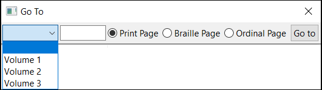

{{html

<ol>

<li value=3>

Type the desired page number in the textbox and select Go To to complete
the action.

</li>

</ol>

}}  
**Note:** If you have made changes to the page numbers in your file, you
can also quickly navigate to those pages you have changed through the
Page Change List in the Page Number Dialog. See \[\[#Viewing Page Number
Changes\|Viewing Page Number Changes\]\] for more details.

### Setting up Your Document

Before getting started on your transcription, there are some basic
settings you might need to adjust in your document, such as which
braille code to use, how the page numbers should appear, how many
braille lines per page, if you need a running head, and so on.

#### Setting Braille Translation

Go to Settings \> Translation Settings


The default translation setting for BrailleBlaster is UEB, but other
translation options include: UEB Uncontracted, UEB with Nemeth
(Contracted and Uncontracted), EBAE (Contracted and Uncontracted),
Spanish US, and Cherokee Plus Nemeth.

#### Setting Page Numbering

Go to Settings \> Page Numbers

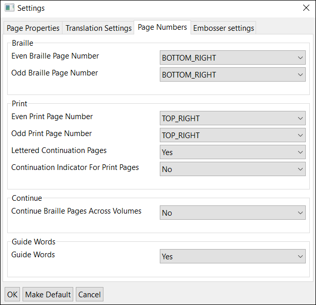

Depending on your agency, they may have different requirements for Page
Numbers. You can choose the placement of both Braille and Print Page
numbers, how you want continuation indicators for your print pages, and
whether you want continuing pages.

#### Adjusting Page Properties, Margins, and Interpoint

Go to Settings \> Page Properties


From here you can set your Page Size, Lines Per Page, Cells Per Line,
and Margins of your document. You can also change whether you want your
margins to be represented in inches or by cells or lines.  
The Page Size default is set to 11.5” x 11”; Margins defaults are set to
top 0.5”, bottom 0.5”, left margin 1.25”, right margin 0.48”.

The option Interpoint can be set for Yes or No. Setting it for Yes will
emboss your file on both sides of the page. Setting it for No will
emboss single-sided.

Once you have chosen your desired settings for the Translation Settings,
Page Numbers, and Page Properties, you can select OK or Make Default if
you want the changes to be applied to future documents. If you do not
wish to save your changes, select Cancel.

#### Setting a Running Head

The Running Head tool allows you to add a Running Head to your document
on all braille pages except for t1 and braille page 1. The default is
for no running head, as it is not needed for all transcriptions.

1.  Go to Insert \> Running Head. This opens a small window.
2.  The option No Running Head is automatically selected. Select the
    radio button Enter Title and type the Running Head into the textbox.

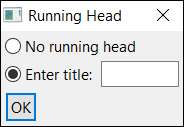

{{html

<ol>

<li value=3>

Select OK to save your changes.

</li>

</ol>

}}

**Note:** Before entering the Running Head, you should confirm that the
running head length fits at the top of the page and works for all print
page numbers as required by [Braille Formats,
2016](http://www.brailleauthority.org/formats/formats2016.html).

### Printing and Embossing

Note that when BrailleBlaster prints, it prints the Print View. When it
embosses, it embosses the braille view. We are working on a way to allow
users to print the braille view for quick review.

#### Setting up a Printer

1.  Go to File \> Print or use the keyboard shortcut (Ctrl + P) to open
    the Print window.
2.  Under Select Printer any printer connected to your computer should
    automatically be listed. However, if your printer does not show up,
    use the Find Printer button.

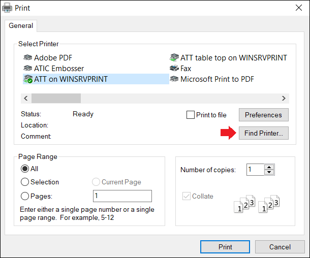

{{html

<ol>

<li value=3>

Select the Print button to print the Print View of your document.

</li>

</ol>

}}

#### Printing a Document 

1.  Go to File \> Print or use the keyboard shortcut (Ctrl + P) to open
    the Print window.
2.  Select a printer.
3.  Customize your print job with Page Range and Number of copies.


{{html

<ol>

<li value=4>

Click the Print button to send your file to the printer.

</li>

</ol>

}}

#### Setting up an Embosser

1.  Go to Settings \> Embosser Settings to select a default embosser, or
    to add or remove an embosser.

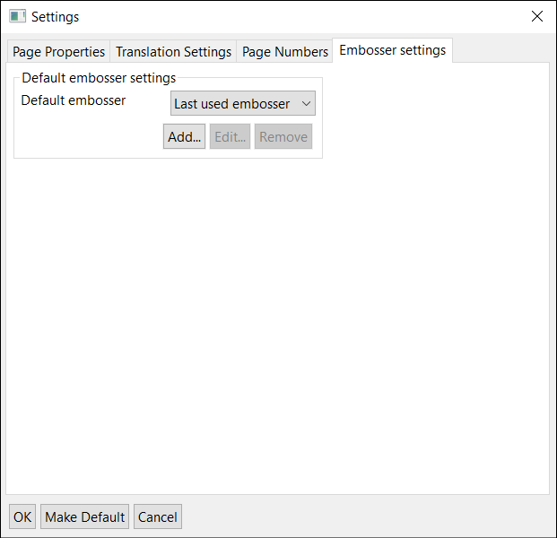

{{html

<ol>

<li value=2>

Complete the fields in the Edit embosser window to configure your
embosser profile.

</li>

<li>

Click OK to complete your embosser profile set up or click Cancel to
close the window without saving any changes.

</li>

</ol>

}}


##### Edit Embosser Fields

**Name:** The name can be as long as you want to identify the embosser,
but BrailleBlaster only displays a limited number of characters.

**Embosser Device:** Select your embosser of choice from the dropdown
list of all available printers and embossers.

**Embosser Manufacturer:** Select your embosser’s manufacturer from the
following choices. Listed after each manufacturer are the available
models.

- APH:
  - PixBlaster
  - PageBlaster
- ViewPlus Technologies:
  - EmBraille
  - Columbia
  - Delta
  - Premier
  - Elite
  - Emprint
  - SpotDot
  - Max
  - Cub
  - Cub JR
- Generic: Three options are available.
  - Text only: This option is used if your embosser model is not
    supported by a specific driver. BrailleBlaster assumes that the page
    size, margins, interpoint, and other settings have been set on the
    embosser itself.
  - Text with margins: This option is similar to the Text only option,
    except that extra spaces are added in the braille to create margins.
  - Graphics Embosser: This option is for embosser models that support
    graphics embossing. This feature is in beta and, therefore, not
    fully supported across all possible models. It is supported by the
    ViewPlus family of embossers.
- IRIE:
  - Braille Buddy
  - Braille Sheet 120
  - Braille Trac 120
- Index Braille:
  - Basic-D V5
  - Basic-D V4
  - Everest-D V5
  - Everest-D V4
  - BrailleBox V5
  - BrailleBox V4
  - Fanfold V5
- Enabling Technologies:
  - Phoenix Gold
  - Phoenix Silver
  - Cyclone
  - Trident
  - BookMaker
  - Braille Express
  - Thomas
  - Thomas Pro
  - Juliet Classic
  - Juliet Pro
  - Juliet Pro60
  - ET
  - Romeo Attache
  - Romeo Attache Pro
  - Romeo Pro50
  - Romeo 25
  - Romeo 60
  - Juliet 120
- Braillo:
  - Braillo 200
  - Braillo 400S
  - Braillo 400SR
  - Braillo 600
  - Braillo 600SR
  - Braillo 270

**Note:** If you do not know your embosser’s manufacturer, it is
recommended you select Generic.

**Embosser Model:** Select from the available Embosser models, listed
above. This varies depending on which manufacturer you chose.

##### Advanced embosser options

The options available on the advanced tab depend upon the model of
embosser selected. These advanced options allow working around various
issues with specific embossers and normally should be left at their
default values. You may be asked to alter the advanced options if you
contact support regarding an embosser issue.

Currently advanced options are only available for the generic “Text
only” and “Text with margins” embosser models. Below is a list of the
advanced options.

- Add margins (true, false)
- Pad page (true, false)
- Form feed on full page (true, false)
- End of line (open byte string)
- End of page (open byte string)
- Header (open byte string)
- Footer (open byte string)

For the options which accept byte string values, you should enter text
representing the bytes to be sent to the embosser for that option. For
most ASCII characters you can just type the character itself. However
for characters which may not be easy to type there are a few escape
sequences which are given in the below list.

- \\ to enter a backslash.
- \r to enter carrage return
- \n to enter new line.
- \t to enter tab.
- \f to enter form feed.
- \x followed by two hexadecimal characters to enter any byte. For
  example to enter the byte with hexadecimal value 1B (sometimes known
  as escape) you would enter \x1b into the option.

#### Embossing a Document 

After completing the steps in \[\[#Setting up an Embosser\|Setting up an
Embosser\]\], you can begin the process of embossing your file.

1.  Go to File \> Emboss or use the keyboard shortcut (Ctrl + E) to open
    the Emboss window.

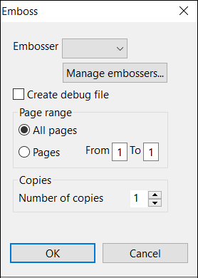

**Note:** If you have not embossed in BrailleBlaster before, you are
prompted to set up a profile for your embosser. See \[\[#Setting up an
Embosser\|Setting up an Embosser\]\].

{{html

<ol>

<li value=2>

Select your embosser, the number of copies you wish to emboss, as well
as the page range (All or a range between 1 and the final page of the
document).

</li>

</ol>

}}

**Note:** You can change the embosser settings at any time by clicking
the Manage Embossers button, which opens \[\[#Setting up an
Embosser\|Embosser Settings\]\] window.

{{html

<ol>

<li value=3>

Click OK to emboss or click Cancel to close the window.

</li>

</ol>

}}

## Automated Features and Tools

### Working with Tables

The Table tool and Table Editor in BrailleBlaster can help you create
and reformat braille tables more efficiently than ever before.

Check out our [Tables in BrailleBlaster
video](https://www.youtube.com/watch?v=zWnds0ioekc)!

#### Inserting/Creating an Unformatted Table

To create a table manually:

1.  Place the cursor where you want the table to begin.
2.  Go to Insert \> Table, which opens the Table Editor screen.

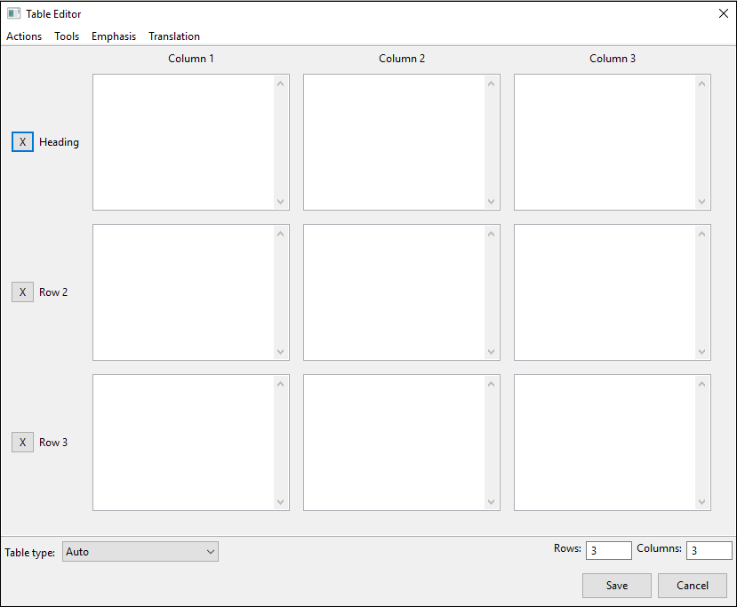

{{html

<ol>

<li value=3>

In the lower right corner of the screen there are two textboxes labeled
Rows and Columns. The default is 3 rows and 3 columns, but you can add
or remove rows and columns by entering the number of Rows and Columns
you want your table to have.

</li>

<li>

Begin adding the text for each entry.

</li>

<li>

(Optional step) To add Emphasis or a different Translation, use the
dropdown menus from the toolbar.

</li>

</ol>

}}

Tools: You can Swap Columns and Rows for better table fit; Add Emphasis
to All or Add Math Translation to All to change all entries at once; or
Remove All Emphasis from the table if emphasis is not necessary.

Emphasis: You can use any of the forms of Emphasis that are found in the
Emphasis toolbar in BrailleBlaster’s main window and apply them to text
in the table.

Translation: You can use Direct Translation, Uncontracted Translation,
or Math Translation to change the braille translation to suit your
needs.

\* Direct Translation is used when you have or need ASCII,
pre-translated braille. An example would be \#id for number sign 14.
This translation type is used to force the translation type using [ASCII
braille](https://en.wikipedia.org/wiki/Braille_ASCII).

\* Uncontracted Translation is used when you need the braille to appear
without any braille contractions. It will still use your currently
selected translation table, just without contractions.

\* Math Translation is used when you need to create linear math. For
this BrailleBlaster uses [ASCII Math](http://asciimath.org/).

Note: The keyboard shortcuts for creating Emphasis and making
Translation changes are the same in the Table Editor as they are in the
\[\[#Toggle Views\|Print View\]\] of BrailleBlaster.

{{html

<ol>

<li value=6>

Check that the Table type in the lower left corner of the window is on
Auto and select Save. Your table is automatically formatted into the
style type of table BrailleBlaster thinks is the best fit for the amount
and length of the information in your table.

</li>

</ol>

}}

#### Creating Formatted Tables

BrailleBlaster can automatically create many types of tables, which can
be selected from the drop-down menu labeled Table type in the lower left
corner. These are arranged to match the formatting of tables outlined in
[Braille Formats
2016](http://www.brailleauthority.org/formats/formats2016.html).

##### Make a Simple Table

The Simple table style sets the table to display as a standard braille
table with columns and rows and a line separator beneath each column
heading.

  
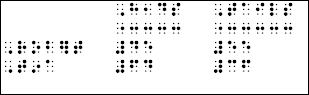

##### Make a Listed Table

The Listed table style changes the table format so that the Row fields
become Cell 5 Headings while information in the Column Heading fields
become the first part of each listed item, followed by a colon, which is
inserted automatically. Information in the column fields is added after
the colon for each appropriate list item.

  


##### Make a Stairstep Table

The Stairstep table creates a table format where each row is represented
as a collection of text with indentions so that each column of the table
is set at a different margin.

  
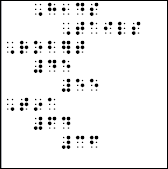

##### Make a Linear Table

The Linear table format places the Column Headings in a \[\[#Creating
the Transcriber’s Notes Page\|Transcriber’s Note\]\] before the text and
each row is put into a linear list separated by colons and semicolons.

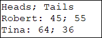  


#### Editing Tables

Any changes to the text within a table must occur within the Table
Editor, whether it is simply correcting a typo or adding columns and
rows, as the text cannot be edited in the Print View. To use the Table
Editor, the cursor must be placed inside text designated as a table.
Otherwise, BrailleBlaster generates the error message “Cursor is not on
table.” Some of the features can be used for any table, while others are
specific to each table type.

##### Adding or Removing Emphasis

Within the Table Editor, any text can be changed to appear with
Emphasis. You can add Emphasis by highlighting text in the table then
selecting the type form from those listed in the menu.

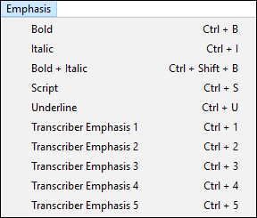

If all of the text in the table needs emphasis added, you can go to
Tools \> Add Emphasis To All and choose from those same options. If
emphasis needs to be removed from part of the text, select the text and
apply the emphasis again. If the entire table is emphasized but should
not be, you can remove all the emphasis at once if you go to Tools \>
Remove All Emphasis.

##### Changing the Table Translation

You can change the translation of the table by highlighting text in the
table then selecting the preferred Translation from the menu: Direct,
Uncontracted or Math. If the entire table needs to appear as math, go to
Tools \> Add Math Translation to All.

##### Edit a Simple Table

When the Simple table style is applied, a button appears to the right of
the drop-down menu labeled Simple Table Options.

1.  Open the Simple Table Options. This opens a window with several
    tools for customizing your table:  
    
    - Cells between columns: Choose either 2 cells between each column
      or 1 cell between each column. The default is 2.
    - Guide dots: Controls whether guide dots appear after material in
      columns. Choose either Enabled or Disabled. The default is
      enabled.
    - Row headings: Controls whether information in column 2 and beyond
      appears on the same line as any runovers in column 1. When
      enabled, materials in column 2 and beyond begin on the same line
      as the runover of the heading in column 1. When disabled, material
      in column 2 and beyond begin on the same line on which the heading
      starts. The default is enabled.
    - Columns widths: Allows control over the cell width of individual
      columns. Choose either default or custom. When custom is selected,
      a set of editable fields appear below the drop-down menu, showing
      each column in the table. (More about column widths following step
      2.)
2.  Click Ok to return to the Table Editor.

About Column Widths: In each field, the number displayed represents the
number of braille cells that column takes up. Between each column is a
number in parentheses, either a (1) or a (2). This number represents the
number of Cells between columns. The fields can be edited to change the
width of each column as desired.

The text Total Width: “X” is shown below the fields, where “X” is the
total number of cells the columns, and the spaces between them, occupy
on the braille page. This number automatically changes as the column
widths are changed. This can be useful to ensure custom column widths do
not exceed the width of the braille page.

##### Edit a Listed Table

When the Listed table style is applied, a button appears to the right of
the drop-down menu labeled Create Transcriber’s Note Heading.

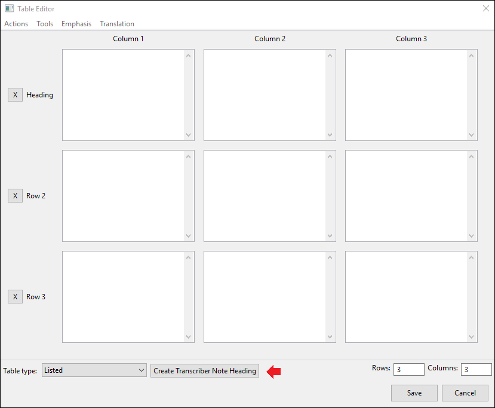

To edit a Listed table:

1.  Select the Create Transcriber Note Heading button. This action adds
    a text field to the top of the Table Editor allowing you to create a
    \[\[#Creating the Transcriber’s Notes Page\|Transcriber’s Note\]\]
    explaining the format of your table.
2.  The 7-5 text field is set to the default text: “Print format is
    changed. Row headings are blocked in cell 5; column headings begin
    in cell 1. All headings are repeated for clarity. A colon separates
    headings from table entries.” This text can be edited to fit your
    document needs, and appears with 7-5 margins.

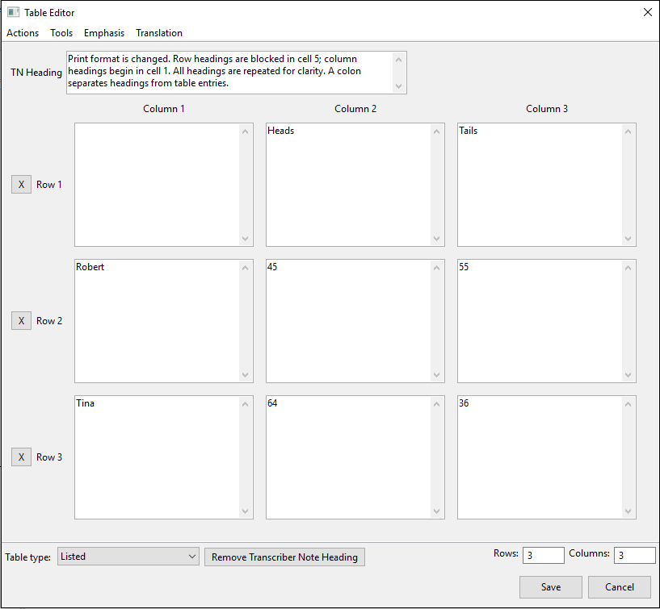

{{html

<ol>

<li value=3>

Click Ok to return to the Table Editor.

</li>

</ol>

}}

##### Edit a Stairstep Table

When the Stairstep table style is applied, a button appears to the right
of the drop-down menu labeled Create Transcriber Note Heading.

To edit a Stairstep table:

1.  Select the Create Transcriber Note Heading button.
2.  Edit using the text fields in the Table Editor to explain the format
    of your table.

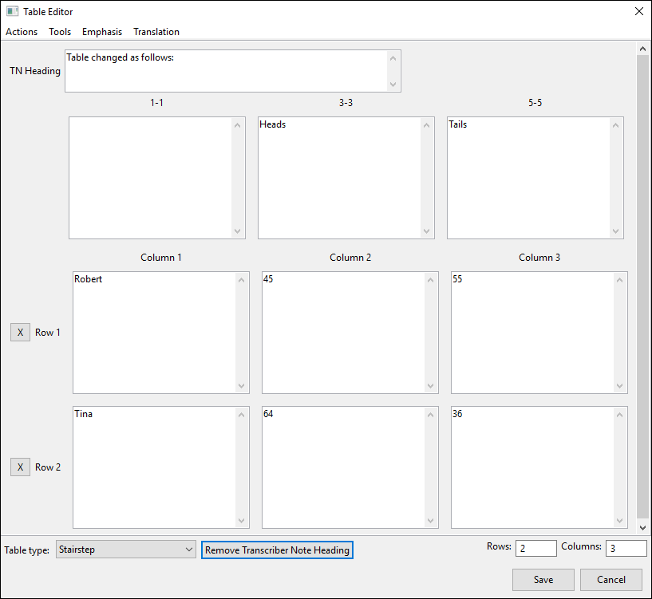

7-5: This first field with 7-5 margins is for the Transcriber’s Note
that precedes the table, informing the reader of the Stairstep format.
The text defaults to “Table changes as follows:” but may be edited as
needed.

1-1, 3-3, 5-5, etc: These next fields proceed in the standard Stairstep
format. Each of these fields can be edited as needed.

{{html

<ol>

<li value=3>

3\. Click Ok to return to the Table Editor.

</li>

</ol>

}}

##### Edit a Linear Table

When the Linear table style is applied, a button appears to the right of
the drop-down menu labeled Create Transcriber Note Heading.

To edit a Linear table:

1.  Select the Create Transcriber Note Heading button.
2.  Edit using the two text fields in the Table Editor to explain the
    format of your table.

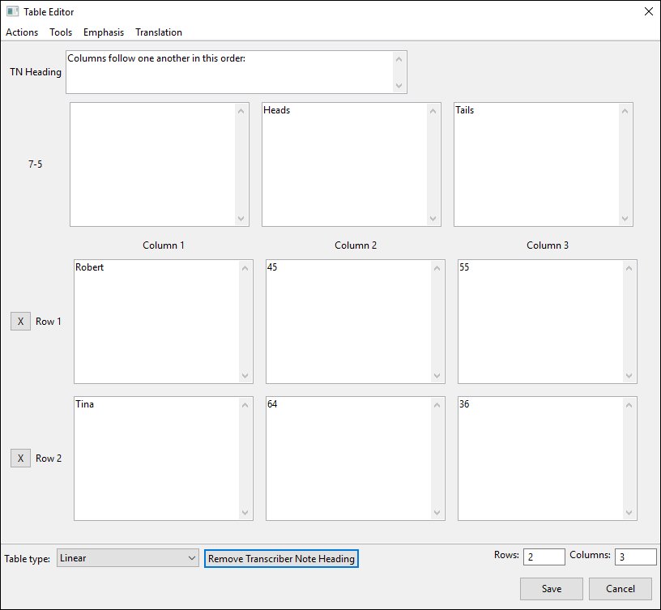

7-5: This field is for the transcriber’s note with 7-5 margins informing
the reader that the table format is changed.

1-3: This field with 1-3 margins is for the explanation of the column
heading order. By default, the text of the column headings is
automatically placed here in order, from left to right, with a colon
following the first column heading and a semicolon following each
additional heading.

{{html

<ol>

<li value=3>

3\. Click Ok to return to the Table Editor.

</li>

</ol>

}}

#### Reformatting Tables

It is possible to reformat your table to another style type. There are
two ways to reformat: Reformat Table and Advanced Reformat.

To reformat a table:

1.  Go to Actions \> Reformat Table.
2.  A pop-up window opens that reads “Reformatting a table will convert
    the table formatting to plain text. Are you sure you want to
    continue?” Click Yes to continue or No to cancel.
3.  When Yes is clicked, a new window opens, displaying a list of
    styles. Select a style to have all the table text reformatted into
    that style.  
    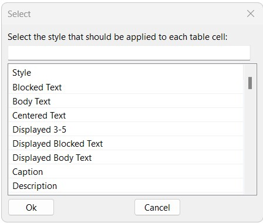
4.  Click Ok to confirm the style choice and reformat that table into
    normal text.

**Advanced Reformat** functions the same way as Reformat Table, but it
allows each field of the table to have a different Style applied to it
when the table is reformatted. The text from each cell of the table
appears and you designate the styles individually.


If you decide you do not want to present information in a table, you can
also remove the table completely. Within the Table Editor, go to Actions
\> Delete Table. The text of the table is completely removed from the
Print View.

### Line Numbering

Line Number Tools adds a set of options to the toolbar for inserting
line numbers into your document. This tool is primarily used for line
numbered Prose, but it can be used for poetry as well. If you are using
a NIMAS file and line numbers are present, BrailleBlaster may have
automatically numbered the lines. If it did not, it is because the line
numbers are not formatted as such in the original file.

#### Inserting Line Numbers

In order for BrailleBlaster to recognize the line numbers, the text in
which they appear must first be wrapped in the Prose tag. This must be
done in order for line numbers to show up in the Print and Braille
Views. If you are adding line numbers to poetry, use the Poetic Stanza
tag instead of the Prose tag when going through the line numbering
process.

To insert a line number to Prose:

1.  Go to Tools \> Line Number Tools. This action adds the Line Number
    Tools to the toolbar.
2.  In the Style View or Breadcrumbs, select the text where you want the
    line numbers displayed, or you can highlight the text in the Print
    View.
3.  To add the Prose tag, click the Wrap Prose button in the Line Number
    Tools toolbar OR use the keyboard shortcut (Ctrl + F2).  
    **Note:** Wrap Prose does not affect the text other than allowing it
    to display line numbers.

{{html

<ol>

<li value=4>

Choose how to number the lines using either the Line Number or Increment
by fields:

</li>

</ol>

}}

Line Number: Use this field to set the initial line number for your
text. Line numbers cannot have more than 10 digits. The default is 1.

Increment by: This field allows you to set the increment by which all
lines are numbered after adding the first line number. The default is 1.

**Example:** With the Increment by field set to 5, each time you insert
a line number after the first, the number increases by 5. So you have 5
for the second line number, 10 for the third, 15 for the fourth, and so
on.

{{html

<ol>

<li value=5>

Select Insert OR use the keyboard shortcut (F2) to place those line
numbers in the text.

</li>

</ol>

}}

#### Editing Line Numbers

If you need to edit or remove a line number, the Edit Line Number tool
on the Line Number Tools toolbar can make those changes.

To edit a line number:

1.  Click on the text that contains the line number you want to edit.
2.  Select Edit Line Number from the Line Number Tools toolbar OR use
    the keyboard shortcut (Ctrl + Shift +F2). This action opens a window
    for editing the line number.
3.  Type the new number in the text field, or delete it to remove the
    line number completely.
4.  Click Apply to save the change.
5.  Click Previous or Next to cycle through the other line numbers in
    the wrapped section of text and edit as needed. Clicking these
    buttons also applys any changes you have made to the line numbers.

**Note:** If BrailleBlaster cannot find any more line numbers, the Edit
Line Number window automatically closes.

{{html

<ol>

<li value=6>

Click DONE, which closes the dialog.

</li>

</ol>

}}

### Making Math

BrailleBlaster uses ASCII Math to create mathematical equations. If you
are unfamiliar with ASCII Math, you can visit http://www.asciimath.org
for a better understanding of how it works.

Check out our [Basic Math with BrailleBlaster
video](https://www.youtube.com/watch?v=a0Ddg3UlXvo)!

BrailleBlaster provides support for both UEB Technical Material and UEB
in Nemeth Contexts. You can select your default math translation table
from the Settings \> Translation menu.

Document types that are supported by Pandoc and include LaTeX are also
supported by BrailleBlaster. LaTeX documents opened in BrailleBlaster
maintain formatting, math, and so on from the original document and does
not require LaTeX software to be installed on the system.

In some cases there may be packages or specific LaTeX notation not
supported by BrailleBlaster. If you encounter this, we suggest that you
convert the document to HTML using another application, and then open
the HTML file in BrailleBlaster. TeX4HT, is an example of a
LaTeX-to-HTML conversion tool. It integrates with the standard LaTeX
compiler, thus offering very good LaTeX support.

**Note:** XHTML files produced by TeX4HT have the .xht file extension.
You must change the .xht extension to **.xhtml** so BrailleBlaster
recognizes the file.

To install and use TeX4HT, go to the website [Producing HTML and MathML
from LaTeX by using
tex4ht](http://http://www.access2science.com/latex/tutorial_txht.xhtml).

#### Editing Math

When transcribing Math material, it is helpful to first turn on the Math
toolbar icons.

Go to View \> Toolbar \> Math. When Math is checked, new icon buttons
appear to help speed up your transcription.

##### Change to Math Translation

Whenever you need to designate that text should appear as Math, you can
get to the Toggle Math Translation tool in multiple ways and easily make
the changes.

To get to the Toggle Math Translation tool:

1.  Select the text you want to designate as Math.
2.  Go to Math \> Toggle Math Translation; or use the keyboard shortcut
    Ctrl + M; or right click and select Math from the context menu.

Your Math text appears highlighted bright pink in the Print view.

##### Add Nemeth Indicators

For Nemeth within UEB contexts, you need to insert Nemeth Indicators
throughout your document, which you can add either blocked or inline
depending on your needs.

1.  Select the text you want to appear between the Nemeth Indicators.
2.  Go to Math \> Nemeth Block or Nemeth Inline

The Nemeth Indicators now appear on the line before and the line after
your Nemeth material if you chose Nemeth Block, or they appear before
and after the Nemeth material only separated by a space if you chose
Nemeth Inline.

##### Add Numeric Passages

For UEB Technical Material you may need to use a Numeric Passage in your
document, which you can add either blocked or inline, depending on your
needs.

To add numeric passages:

1.  Select the text you want to appear within the Numeric Passage.
2.  Go to Math \> Numeric Passage Block or Numeric Passage Inline.
    - Choosing Numeric Passage Block places the Numeric Passage on the
      line before and the line after your UEB Technical material.
    - Choosing Numeric Passage Inline places the Numeric Passage before
      and after the UEB Technical material separated only by a space.

##### Add Numeric Spaces to a Series of Numbers

You can create a numeric series by using the Numeric Series tool as
described:

1.  Highlight the text you want to be a numeric series.
2.  Go to Math \> Numeric Series.

This action places dot 5’s where the spaces previously were. If there
are two spaces, there are two Dot 5’s.

##### Get Math Help

You can also access the Math Help at any time. Go to Math \> Math Help.
This action opens a quick list of definitions for the Math tools and the
button icons.


#### Making Linear Math

The ASCII Math Hub makes it easier to enter or edit unfamiliar math
equations in a linear format.


To make a linear equation:

1.  Go to Math \> ASCII Math Hub.
2.  From here, you can select various types of equations and mathematic
    symbols, which are organized into tabs. You can show or hide these
    tabs by using the Show Tabs option in the ASCII Math Hub toolbar and
    selecting the tabs you want to view. The tabs include:
    - Operation Symbols: A list of mathematical symbols used in an
      operation (e.g., division sign, multiply, union, etc.).
    - Miscellaneous Symbols: A list of a variety of symbols frequently
      used in many types of mathematic notation (e.g., absolute value,
      angle, plus minus, etc.).
    - Relation Symbols: A list of symbols that show the relationship
      between two parts of an equation (e.g., equals, greater than,
      proportional to, etc.).
    - Greek Symbols: A list of Greek letters (e.g., alpha, beta, capital
      delta, etc.).
    - Logical Symbols: A list of symbols commonly used in notations of
      logical expressions (e.g., true, there exists, if and only if,
      etc.).
    - Grouping Symbols: A list of symbols used for grouping within
      mathematical equations (e.g., left and right braces, left and
      right brackets, left and right curly braces, etc.).
    - Arrows: A list of arrows that can be use in mathematical equations
      (e.g., double left arrow, down arrow, double right left arrow,
      etc.).
    - Accents: A list of accents that may appear in mathematical
      contexts (e.g., combining circumflex, dot x, double dot x, etc.).
    - Functions: A list of function abbreviations used in mathematic
      equations (e.g., cosine, cotangent, cosecant, etc.).
    - Special: Contains column vectors, complex subscripts, matrices,
      and script order templates.
    - Examples: A list of common mathematic operations shown in ASCII
      Math and in an image for user convenience (e.g., complex fraction,
      exponent, overbar, etc.).
    - Search: Here you can search for an ASCII Math symbol by typing it
      into the textbox and clicking OK.

{{html

<ol>

<li value=3>

Select the Insert button to put your text in BrailleBlaster.

</li>

<li>

(Optional step) Choose Replace Current Math to replace a previous entry
of math that was made with your current entry. Select Previous Math or
Next Math to navigate through the math elements in your document.

</li>

</ol>

}}

**Note:** You can also make the ASCII Math Hub full screen by choosing
Full Screen in the Settings drop-down menu.

**Note:** Any math that you enter using the ASCII Math Hub is
highlighted in bright pink in the Print View.

**Note:** Font Size can be be increased or decreased by pressing the
Plus(+) or Minus(-) buttons next to where it says Font Size.

#### Making Spatial Math

To create or edit spatial math in BrailleBlaster, open the Spatial Math
Editor.

**Note:** You cannot edit spatial math in the Print View. Instead, place
your cursor in the spatial math you want to change, open the Spatial
Math Editor, and make any changes needed.

Check out our [Spatial Math in BrailleBlaster
video](https://www.youtube.com/watch?v=yz9vefDsj1g)!


To create spatial math:

1.  Go to Math \> Spatial Math Editor.
2.  Select the Container Type, or type of spatial math, you want to
    create in the menu. The options are:
    - Number Line Editor
    - Matrix
    - Math Templates
    - Regular Text

#### Set up Spatial Math

Some fields are available no matter what container type you have chosen.
Container specific settings appear under the settings menu after you
have selected that Container Type. There are general setting options and
buttons to review before entering your spatial math.

Settings: These change based on your container type and translation. It
allows for Nemeth Passage Indicators, Grade 1 Passage, or Numeric
Passage Indicators to be applied inline for the translation it is set
on.

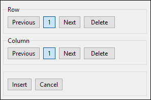

**Row:** Allows you to customize the rows needed for your Spatial Math
with three buttons:

Previous: Allows you move to the previous number in the list

Next: Allows you to add more rows or move to the next row number in the
list.

Delete: Removes a row from list.

**Column:** Allows you to customize the columns needed for your Spatial
Math with three buttons:

Previous: Allows you move to the previous number in the list

Next: Allows you to add more columns or move to the next column number
in the list.

Delete: Removes a column from list.

**Insert:** Places your new Spatial Math into your file where your
cursor is placed or updates your previously created Spatial Math
according to your edits.

**Cancel:** Closes the window without saving any changes.

#### Editing Math Number Lines

Before you enter your Number Line information in the Spatial Editor,
review the settings to ensure the best translation.

##### Settings Specific to Number Lines

- Reduce Fraction: Automatically reduces the fractions on your number
  line. If you want the same denominator to appear across the number
  line, do not use Reduce Fraction.

**Example:** If your number line is labeled 0 to 1 with an interval of
¼, the Reduce Fraction option would make your number line read: 0, ¼, ½,
¾, and 1, rather than 0, ¼, 2/4, ¾, and 4/4.

- Beveled Fraction: Sets the fraction lines in your number lines to a
  Beveled Fraction, which is a diagonal line in print. Beveled Fractions
  in UEB use the general fraction line; Nemeth uses the diagonal line.


- Add Arrows to Line: Puts arrows on the beginning and end of your
  number line.

<!-- -->

- Stretch Across Page: Stretches the number line across the entire
  braille page. By default, BrailleBlaster tries to use the minimum
  number of cells to fit your number line on the page.

<!-- -->

- Remove Leading Zeros: When your number line has decimals, Remove
  Leading Zeros omits the zeros that appear before the decimal. For
  example, 0.5 appears as .5 in braille.

<!-- -->

- Number Line View: Sets whether your number line appears as math or
  plain text:
  - Math Entry: Allows a sequential number line to be put in according
    to your needs.
  - User Text: Allows you to enter text instead of math for the labeled
    tick marks on the number line. This adds the option Line Marker,
    which allows up to 10 markers along the number line.

<!-- -->

- Interval/Points: Creates either Points along the number line or an
  Interval along a segment of the number line.
  - Points: Creates points along the number line
  - Interval: Creates a line segment on the number line
  - None: Removes any Intervals or Points from the number line

<!-- -->

- Start Interval Type: Inserts a symbol at the start of your line
  segment. Your options are:
  - Empty Circle:  
    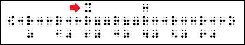
  - Full Circle:  
    
  - None:  
    

<!-- -->

- End Interval Type: Creates a symbol at the end of your line segment.
  Your options are:
  - Empty Circle:  
    
  - Full Circle:  
    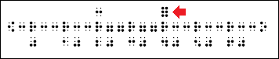
  - None:  
    

##### Create a Number Line

BrailleBlaster calculates your number line automatically as long as the
fields are filled in using numbers that make sense mathematically:

- Count By: The amount you want each number on the number line to
  increase by.
- Line Start: The first number of your number line.
- Line End: The last number of your number line.
- Interval Start: The first number of your line segment.
- Interval End: The last number of your line segment.

Once you have filled out these fields, select Insert and the math is put
into your file at the location of the cursor.

#### Editing Matrices

Before you enter your Matrix information in the Spatial Editor, review
the settings to ensure the best translation.

##### Settings Specific to Matrices

- Translation: Allows you to choose the type of Translation for your
  Matrix:
  - Uncontracted
  - Direct
  - ASCII Math
  - Literary

<!-- -->

- Add Ellipsis to Blank Cells: Automatically adds ellipses to blank
  spaces in your Matrix.

<!-- -->

- Grouping Device: Allows you to change which grouping indicator
  encloses your Matrix cells. The options include:
  - Bracket
  - Parentheses
  - Brace
  - Vertical Bar
  - Big Bracket
  - Big Parentheses
  - Big Brace
  - Big Vertical Bar

<!-- -->

- Wide Overflow Style: Automatically used when you enter large amounts
  of text in the Matrix cells or there are many Matrix cells.
  BrailleBlaster detects when a Matrix is too large to fit on one
  braille page and formats your text based on your overflow style and
  how you set up your document in \[\[#Adjusting Page Properties and
  Margins\|Page Properties\]\]. You have two overflow options:
  - Block and Blank Line: Makes each cell of the Matrix into a block
    with the overflow of text appearing vertically in the block
  - Indent Columns: Formats each of the Matrix columns into a block and
    indents each column by two braille cells.

**Note:** If you have the Indent Columns option selected, but only one
cell is too long for a braille page, BrailleBlaster overrides this with
Block and Blank Line formatting in order to fit the Matrix on the page.

- Row & Column: Customizes the number of rows and columns for each
  Matrix, up to 9 for each.

#### Using Math Templates

With Math Templates you can add Identifiers, Operators, and Operands to
your equations and customize them to fit your needs.

##### Settings Specific to Math Templates

Before you enter your Math Template information in the Spatial Editor,
review the settings to ensure the best translation.

- Template Type: Changing your template type changes the layout of the
  boxes where you enter your text. The three template types are:
  - Simple Template
  - Fraction Template
  - Division Template

<!-- -->

- Operator: Allows you change the operation sign you want to use in your
  equation. You can also change your operator from the drop-down menu of
  the text area.
  - Plus
  - Minus
  - Multiply

<!-- -->

- Operands: Customizes the number of operands in your equation, up to
  20.

<!-- -->

- Solution: Allows you to enter the solution for the equation to your
  template.
  - False: No solution is shown
  - True: You can enter the solution, which is shown

#### Making Grids with Regular Text

You can make a grid out of any text and can customize the position of
that grid.

##### Settings for Regular Text

Before you enter your grid information in the Spatial Editor, review the
settings to ensure the best translation.

Vertical Alignment: Aligns your grid entries vertically with options:

- Top
- Center
- Bottom

Horizontal Alignment: Aligns your grid entries horizontally with
options:

- Right
- Center
- Left
- Trim

### Working with Tactile Graphics

#### Creating Blank Space for a Tactile Graphic

The Image Placeholder allows you to insert blank lines to leave the
required amount of space for a graphic within the text.

1.  Place your cursor where you want to insert the blank lines.

**Note:** The blank lines will be inserted into the document before the
cursor.

{{html

<ol>

<li value=3>

Go to Insert \> Image Placeholder. This action will bring up a window.

</li>

<li>

In the window, a textbox is shown with the label: Number of lines
(\<25). Type the number of lines you need for the graphic, but it must
be a number less than 25.

</li>

<li>

Once you have typed the number you need, select Submit to add in the
lines or Cancel to go back to the document without making any changes.

</li>

</ol>

}}

See also the sections on \[\[#Creating Facing Pages\|Creating Facing
Pages\]\] and \[\[#Adding Blank Pages\|Adding Blank Pages\]\], as these
are important for adding tactile graphics to interpoint documents.

#### Attaching Images to Image Placeholders

Blank lines can be associated with an image now.

Go to Insert \> Image Placeholder and insert the number of blank lines
in the dialog box to account for the graphic.

Use the Insert Image Location button to choose a file from your computer
to associate with that set of blank lines. When the association is made,
the braille and graphics can be embossed together to a supported
embosser. Currently, only ViewPlus graphics embossers are supported;
however, more are planned for the future.

## Other Editing Tools and Features

### Formatting Styles

Styles are an integral part of the transcription process. Giving text
elements different styles distinguishes how the print is formatted,
providing clarity for the braille reader.

#### Viewing Applied Styles

By using Breadcrumbs and the Style View you can see what kinds of styles
are applied to the text and how the text is grouped.

##### Viewing Style Containers

Breadcrumbs is a feature that shows what styles are applied to sections
of the text. Like a trail of breadcrumbs, it shows every style used
leading up to that specific piece of text.

1.  Go to View \> Toggle Views \> Breadcrumbs. This makes Breadcrumbs
    visible in the bottom section of the toolbar.
2.  Breadcrumbs shows different levels of styles that have been applied
    to a piece of text. Clicking on one of the section buttons
    highlights everything within that style level.

##### Viewing Styles in the Main Window

Within the default Settings, the Style View for BrailleBlaster is
located at the left-most section of the document view. This view shows
what style has been applied to the selection of text in the Print View.
This is helpful for viewing types of formatting in the document. You can
change where this view is located on the screen, as well as turn it on
and off. See \[\[#Toggle Views\|Toggle Views\]\] for details.

#### Applying Styles

BrailleBlaster’s formatting is contextual, and the Styles conform to the
rules laid out in [Braille Formats
2016](http://www.brailleauthority.org/formats/formats2016.html). How
each style functions in BrailleBlaster is detailed in the \[\[#Appendix
A: Formatting Styles\|Style Appendix\]\].

To apply a style:

1.  Place your cursor in an element OR highlight a section of text where
    you want to apply a style.
2.  Go to Styles and select the style you want the element to have OR
    select the desired style from the toolbar buttons.
3.  Once selected, that style is applied to the text.

##### Repeating the Last Used Style

The Repeat Last Style tool is used to continuously apply the last used
style to new text elements.

To repeat the last style:

1.  Place your cursor in an element OR highlight a section of text where
    you want to apply a style.
2.  Go to Styles \> Repeat Last Style or use the keyboard shortcut
    (Ctrl + R).
3.  The style last applied to the previous element is now applied to the
    current element.

**Note:** If no style has been applied, and this feature is used, a
pop-up opens letting you know there is no style to repeat.

##### Removing a Style

In BrailleBlaster, you can replace any style with another style from the
Style toolbar, but there is a tool that allows you to remove certain
styles from a text element in one simple step. Unwrap Element allows you
to remove certain styles, including List, Poetic Stanza, Box, Full Box,
and Prose.

To remove a style:

1.  Have Breadcrumbs displayed in the toolbar. See \[\[#Viewing Applied
    Styles\|Viewing Applied Styles\]\] for instructions on how this
    done.
2.  Place your cursor on the text you want to Unwrap.
3.  Select the container button for the element in Breadcrumbs. The text
    is now highlighted.
4.  Go to Tools \> Unwrap Element.

**Note:** In some cases, Unwrap Element may be grayed out or unavailable
to select. If this occurs, you must apply another style instead of using
this tool.

{{html

<ol>

<li value=5>

After selecting Unwrap Element, the text is formatted as Body Text, the
default style in BrailleBlaster, which presents text as indented
paragraphs with margins of 3-1.

</li>

</ol>

}}

##### Adjusting the Number of Style Levels:

You can adjust the number of Style Levels that appear for each style
with multiple levels. The default number of levels displayed is five,
but you might find you need fewer or more levels. BrailleBlaster can
show up to eight.

To adjust the number of styles:

1.  Go to Styles \> Configure \> Style Levels.
2.  Select the number of levels that you wish to view in the dropdown
    menus in the Styles toolbar.

#### Using Style Options

Sometimes it is necessary for a braille document to have additional
style rules on certain parts of the text. Style Options allows you to
add various style rules to the text.

##### Setting Your Own Margin

There are times when you have text that doesn’t conform to
BrailleBlaster’s existing style options. There are many oddities when
formatting braille and they can’t all be covered by a predetermined
style. For these situations, you can use Set Cell Position, which allows
you to set the indentation for the line of text at the cursor’s
position.

To set your own margin:

1.  Place your cursor before the element you wish to indent.
2.  Go to Edit \> Set Cell Position, which causes a textbox to open.
3.  Type the cell number where you want your text to start into the
    textbox.
4.  Click OK. The text element is pushed over into the cell number you
    entered.

**Note:** If you type in a number lower than the cell the text is
currently on, it drops down to the next line and begins on that cell.
This command does not work if the cursor is at the end of a line. It is
only applied to one line at a time.

##### Keeping Text on the Same Line

Hitting Enter moves the text down to the next line, but it treats it is
as a new element, like a new paragraph in Body Text or a new item in a
List. When you don’t want a new element, but need text to stay together,
you can insert a Line Break. This inserts a break at the location of the
cursor, dropping all text following the cursor down to the next braille
line.

To keep text on the same line:

1.  Place your cursor where you want your line break to be.
2.  Go to Edit \> Line Break OR use the keyboard shortcut (Shift +
    Enter).
3.  The text moves down to the next line and starts at the appropriate
    runover.

**Note:** The text starts in the runover cell determined by the current
element’s style. For instance, if the style is Body Text (which has 3-1
margins), inserting a line break starts the new line on cell 1.

##### Keeping Text on the Same Page

Don’t Split is the only style option that wraps elements of different
styles. It is used to keep the selected elements together on the same
braille page.

To keep text on the same page:

1.  Highlight the elements that need to be kept together.
2.  Go to Styles \> Options \> Don’t Split and apply the style option.

**Note:** If the selected elements do not fit on a single braille page,
any text longer than one braille page continues on to the next braille
page.

##### Keep With Next

Selecting Keep With Next causes that element to stay with whichever
element follows it.

To keep an element with the next one:

1.  Select the desired element by highlighting it.
2.  Go to Styles \> Options \> Keep With Next and apply the style
    option.

**Note:** If the second element moves to a new braille page because of
changes to formatting, the element that has the Keep With Next style
applied also moves to that braille page.

##### Adding Blank Lines

The style options Lines Before and Lines After allow you to set the
number of blank lines either before or after. Every style that begins on
a new line automatically has a value of 1 for Lines Before and Lines
After. If you want that element to have a blank line before or after it,
set the value as 2. Some styles already have blank lines by default,
such as Centered Headings, which have a value of 2 for Lines Before and
a value of 2 for Lines After. To add an extra blank line before a
Centered Heading, set the Lines Before value as 3.

To add blank lines:

1.  Select the desired element(s) by highlight it.
2.  Go to Styles \> Options.
3.  Click on the Lines Before or Lines After style option.
4.  In the window, enter the value (number of lines) in the textbox.

##### Adding Double Lines

The style option Double Spaced allows you to apply double-line spacing
to highlighted text.

To apply double-line spacing:

1.  Highlight the desired elements to select.
2.  Go to Styles \> Options \> Double Spaced and apply the style option.

##### Removing Text From Lines with Page Numbers

The style option Skip Number Lines determines whether the element should
skip lines that contain page numbers.

To remove text from lines with page numbers:

1.  Go to Styles \> Options \> Skip Number Lines.
2.  Choose one of the following options:
    - Top: Prevents the element from appearing on the top line of the
      braille page
    - Bottom: Prevents the element from appearing on the bottom line of
      the braille page
    - Both: Causes the element to skip both the top and bottom lines of
      the braille page
    - None: Removes other Skip Number Line options if they are no longer
      needed

Once the style has been selected, it is immediately applied.

**Note:** Keep in mind that even if None is selected, when you have a
Running Head or Guide Words, those lines are automatically skipped
because they are applied to those elements.

##### Creating Facing Pages

Page Side is used to set which side of a page certain text needs to be
on within interpoint documents. This is useful when you have graphics or
material that needs to appear on facing pages, such as tables or
question and answer choices. When formatting decisions cause an element
to move, the selected material continues to appear on the type of page
selected. If the page side isn’t significant, and you just need a blank
page added, see \[\[#Adding Blank Pages\|Adding Blank Pages\]\].

To create facing pages:

1.  Go to Styles \> Options \> Page Side.
2.  There are two options to choose from: left or right.
    - Page Side Left: Applying this to an element causes that element to
      appear only on the left-hand side, which is an even page.
    - Page Side Right: Applying this causes that element to appear only
      on the right-hand side, which is an odd page.
3.  If the text is on the type of page you have selected, it remains on
    that page; but if it is not, it moves to the type of page you
    selected.

##### Adding Blank Pages

The style options New Pages Before and New Pages After are used to
insert a blank braille page before or after the selected element. This
ensures that formatting decisions made before this point in the document
do not remove a blank page that the transcriber deems necessary. If the
blank page is needed in order for material to appear on facing pages,
see Creating Facing Pages, as that style option ensures your material
stays facing.

To add a blank page:

1.  Go to Styles \> Options.
2.  Click on the New Pages Before or New Pages After style option.

If you chose New Pages Before, the highlighted element will move to a
new page. You can then press Ctrl+Enter before the element to add a
blank page.  
If you chose New Pages After, the text after the highlighted element
will move to a new page. You can then press Ctrl+Enter after the element
to add a blank page.

### Working with Page Numbers

BrailleBlaster has many tools for numbering braille and print pages
efficiently.

#### Adding Page Numbers

##### Adding Print Page Numbers

If Print page numbers have not automatically been added to your
document, you can add them manually by using the Page tool.

To add print pages:

1.  Type the print page number into your document where a print page
    break should occur.
2.  Highlight that number and go to Styles \> Miscellaneous \> Page or
    use the
    
    button on the Styles toolbar.

If the number is in the middle of a braille page, a print page change
indicator appears across the page with the print page number at the
right margin.

##### Adding a Page Change Indicator with No Print Page Number

You may encounter material or sections with no print page numbers. If
the print page breaks are still relevant, you can manually add a blank
page change indicator that has no print page number.

To add a page change indicator:

1.  Place your cursor before the location where you want the page change
    indicator to appear.
2.  Select Insert \> Blank Print Page Indicator.

##### Adding Braille Page Numbers

Braille page numbers are added automatically with BrailleBlaster. You
can also add more braille pages (if needed) by using Page Break.

**Note:** There must be text present after the cursor to use Page Break.

To add braille page numbers:

1.  Place your cursor where you want the Page Break to appear.
2.  Go to Edit \> Page Break OR use the keyboard shortcut (Ctrl +
    Enter).

The break is inserted after the cursor, forcing all text after the
cursor to the next braille page. You can continue to use this feature to
create more braille pages as needed.

#### Editing Page Numbers

BrailleBlaster makes editing page numbers easy with the Edit Page Number
tool. This tool can be used to change print and braille page numbers as
needed.

To edit a page number:

1.  Put your cursor anywhere on the page that you wish to change.
2.  Go to Edit \> Edit Page Number or right-click and select Edit Page
    Number from the context menu. This action opens the Page Number
    Dialog window.

The Page Number Dialog gives you several options to change both your
print and braille pages.

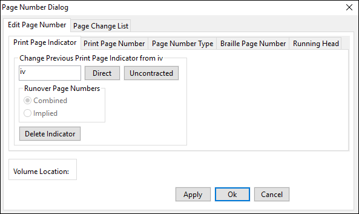

##### Changing Print Page Indicators

**Note:** This option only appears if a Print Page Number is already
present on the page selected.

To change a print page indicator:

1.  In the Page Number Dialog window, go to Edit Page Number tab \>
    Print Page Indicator tab.
2.  Find the “Change Previous Print Page Indicator from \[X\]” section.


{{html

<ol>

<li value=3>

Change the number in the textbox (which displays the current print page
number) to the desired number. The page number can be presented in
Direct or Uncontracted braille. You can also have a print page number
that is a combination of two print page numbers separated by a hyphen.
This changes the first page number and all continuation pages.

</li>

<li>

If you have NOT inserted a hyphen into the Change Previous Print Page
Indicator textbox, you can select Ok to save your changes or Cancel to
leave without saving and skip steps 5 and 6.

</li>

<li>

If you HAVE inserted a hyphen into the Change Previous Print Page
Indicator textbox, the Runover Page Numbers options become available.

</li>

</ol>

}}

- Combined: This option causes the print page runovers to appear as
  hyphenated numbers.
- Implied: This option causes the print page runovers to be displayed
  containing only the second print page number.

**Note:** The options for Runover Page Numbers are based on rules for
print page numbers found in [Braille Formats, 2016 Section
1.11](http://www.brailleauthority.org/formats/formats2016.html).

{{html

<ol>

<li value=6>

After you have selected the Runover Page Number option that is
appropriate for your document, select Ok to save your changes or Cancel
to leave without saving.

</li>

</ol>

}}

##### Changing Print Page Numbers

To change a print page number:

1.  In the Page Number Dialog window, go to Edit Page Number tab \>
    Print Page Number tab.
2.  Find the “Change Print Page Number from \[X\]” section.

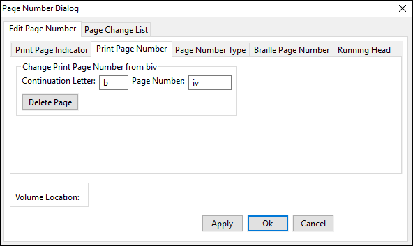

{{html

<ol>

<li value=3>

Enter the appropriate changes into one or both of the textbox fields.
**Note:** All numbers must be entered in ASCII. There are two textbox
fields to fill in:

Continuation Letter: You can use this textbox to change the Continuation
Letter from what is shown (i.e., b) to whatever letter is needed (i.e.,
c). All page numbers runovers that follow automatically update
accordingly. This is useful if your agency has special requirements for
numbering blank pages.

Page Number: Only changes that instance of the print page number,
without changing the surrounding page numbers.

</li>

<li>

Select Ok to save your changes or Cancel to leave without saving.

</li>

</ol>

}}

##### Changing Braille Page Numbers

To change braille page numbers:

1.  In the Page Number Dialog window, go to Edit Page Number tab \>
    Braille Page Number tab.
2.  Find the “Change Braille Page Number from \[X\]” section.

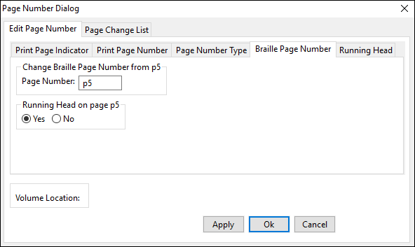

{{html

<ol>

<li value=3>

Enter the appropriate braille page number for the current page.

</li>

<li>

Choose Yes for that page to have a \[\[#Setting a Running Head\|Running
Head\]\], or No if not.

</li>

</ol>

}}

Sometimes you may need to change the type of braille page number you
want for your document.

To change the type of braille page number:

1.  In the Page Number Dialog window, go to Edit Page Number tab \> Page
    Number Type tab.


{{html

<ol>

<li value=2>

Select one of three options from the drop-down menu:

Normal: The braille page number shows the ordinal number.

T-page: The braille page number starts with the letter “t” for
transcriber-generated pages.

P-page: The braille page number starts with the letter “p” for
preliminary pages.

</li>

</ol>

}}

**Note:** Once you change the braille page type, the braille page
numbers continue to appear as that type until a new braille page number
type is selected.

{{html

<ol>

<li value=3>

Select Ok to save your changes or Cancel to leave without saving.

</li>

</ol>

}}

#### Deleting Page Numbers

##### Deleting Print Page Numbers

There are two options for deleting print page numbers. You can delete
the print page indicator or the print page.

To delete a print page indicator:

1.  In the Page Number Dialog window, go to Edit Page Number tab \>
    Print Page Indicator tab.
2.  Select the Delete Indicator button to delete the print page number
    and all continuation indicators with that print page number. The
    pages remain in your document following the page change indicator,
    but without print page numbers. All other print page numbers remain
    the same.
3.  Select Ok to save your changes or Cancel to leave without saving.

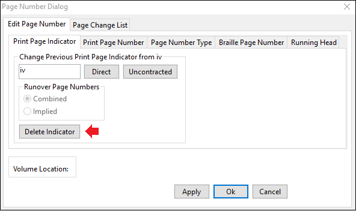

To delete a print page:

1.  In the Page Number Dialog window, go to Edit Page Number tab \>
    Print Page Number tab.
2.  Select the Delete Page button to delete the specific print page
    number and continuation letter currently in the textboxes. The print
    page number is removed from the current braille page and is applied
    on the next braille page.

**Example:** If you delete print page c5, the current c5 no longer has a
print page number, and the next page, d5, becomes print page c5.

{{html

<ol>

<li value=3>

Select Ok to save your changes or Cancel to leave without saving.

</li>

</ol>

}}


**Note:** You can also move or remove Print Page Numbers by going to
Settings \> Page Numbers. The default location is the top right for both
Even Print Page Number and Odd Print Page Number, but you can change
each of these depending on what your agency requires. You can move them
to the top left, bottom left, or bottom right of the page, or have none.

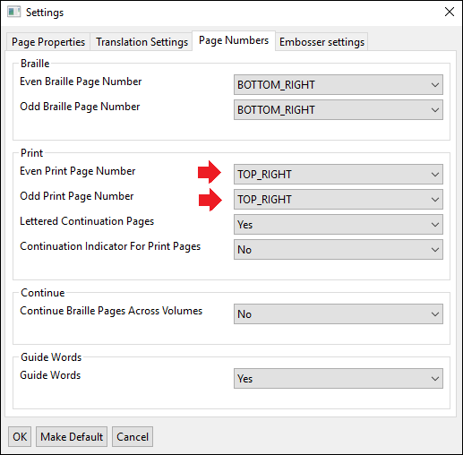

##### Deleting Braille Page Numbers

To delete a Braille page number, first delete the text or blank space on
that page. If you want to move or remove your braille page numbers, go
to Settings \> Page Numbers to choose how you want your Braille page
numbers to appear in your document. The default is the bottom right for
both Even Braille Page Number and Odd Braille Page Number, but for each
type you can move them to the bottom left, top right, or top left of the
page, or have none.


#### Viewing Page Number Changes

Within the Page Number Dialog window, there is a Page Change List tab
that lists all the changes you have made to the print and braille page
numbers. You can delete your changes by checking the checkbox next to
the corresponding change and then clicking the Delete button at the
bottom of the window. You can navigate to the changed pages by clicking
the Go To button to the right of the list item.


### Working with Emphasis

There are many forms of Emphasis in braille that allow the text to be
prominent. Also known as font attributes or typeforms, these range from
common forms of print emphasis to those unique to braille. Each type of
emphasis is explained in Section 9 of the Rules of Unified English
Braille, and when to use or ignore font attributes is detailed in
[Braille Formats, 2016, Section 5:
Typeforms](http://www.brailleauthority.org/formats/formats2016.html).

#### Adding Emphasis

In BrailleBlaster, emphasis can only be applied to text that has already
been created. Highlight a selection of text and add the desired emphasis
using the appropriate keyboard shortcut or toolbar button, or go to the
Emphasis menu.

- Bold (Ctrl + B): Adds Bold to a symbol, word, or passage.
- Italics (Ctrl + I): Adds Italics to a symbol, word, or passage.
- Underline (Ctrl + U): Adds an Underline to a symbol, word, or passage.
- Script (Alt + Shift + S): Add Script indicators to a symbol, word, or
  passage that mimics handwriting in print. The selected text appears
  light pink in the print view.
- Transcriber Note Symbols: Although Transcriber’s Note (TN) indicators
  are not a print typeform, they add a special emphasis for the braille
  reader. TN indicators are added at the beginning and end of the
  selected text. Adding this emphasis across three elements, for
  example, puts an opening TN indicator at the beginning of the first
  element and a closing TN indicator at the end of the last element.
- Transcriber-Defined Typeforms: There are some types of emphasis in
  print with no braille equivalent such as highlighting, colored font,
  or double underlining. Transcriber-Defined Typeforms allow this
  emphasis to be represented with a braille symbol that is defined on
  the Transcriber’s Notes Page of the document. These indicators and how
  to use them are described in Section 9.5 of the Rules of Unified
  English Braille.
  - Transcriber-Defined 1 (Shift + Alt + 1)
  - Transcriber-Defined 2 (Shift + Alt + 2)
  - Transcriber-Defined 3 (Shift + Alt + 3)
  - Transcriber-Defined 4 (Shift + Alt + 4)
  - Transcriber-Defined 5 (Shift + Alt + 5)

#### Removing Emphasis

Emphasis can be removed by highlighting the text that is emphasized and
selecting the same emphasis option that is currently applied to it.
BrailleBlaster also has tools to make the removal of emphasis easier
from larger pieces of text with more than one applied emphasis style.

##### Removing Emphasis from a Selection

This feature removes all emphasis from a highlighted selection. This
works for whatever amount of text is selected: a few words, a few
paragraphs, or several pages of text.

1.  Highlight any amount of text with emphasis you want removed in your
    file.
2.  Go to Emphasis \> Remove Emphasis from Section or use the keyboard
    shortcut (Ctrl + Shift + R)

The highlighted text is no longer emphasized.

##### Removing All Emphasis from Headings

Headings do not usually need to be emphasized in braille. You can
manually remove emphasis for each heading, or a use tool to remove
emphasis from all headings in one action.

**Note:** It is advisable to save your work before using this feature.

Go to Emphasis \> Remove All Emphasis from Headings.

**Note:** You have to add emphasis manually to headings where it should
be kept after using this tool.

##### Removing All Emphasis from List Prefixes

In print documents, the numbers or letters at the beginning of list
items can appear in bold. This Emphasis is usually considered
unnecessary in braille and is typically removed. BrailleBlaster can
search the file and remove the emphasis from numbers and letters at the
beginning of lists.

**Note:** It is advisable to save your work before using this feature.

Go to Emphasis \> Remove All Emphasis from List Prefixes.

**Note:** You have to add emphasis manually to any list prefixes that
require it after using this tool.

##### Removing All Emphasis from Alphabetic Reference Entry Words

Print often adds emphasis to the entries in indexes and glossaries, but
[Braille Formats,
2016](http://www.brailleauthority.org/formats/formats2016.html) says to
ignore such font attributes unless they are needed for distinction, such
as foreign words or book titles. BrailleBlaster allows you to remove the
emphasis from all of the entry words in those sections designated as a
glossary or index in one action.

**Note:** It is advisable to save your work before using this feature.

Go to Emphasis \> Remove Emphasis from Alphabetic Reference Entry Words.

**Note:** You have to add emphasis manually to any entry words that
require it after using this tool.

### Modifying the Braille Translation

BrailleBlaster works with a program called LibLouis to give transcribers
the most accurate translation possible, but sometimes the translation is
inaccurate and needs be changed. BrailleBlaster has several tools for
correcting braille text in your current document and applying it to
future documents.

#### Entering Braille Directly into a Document

Six Key Mode allows six key transcription within BrailleBlaster. When
this tool is activated, you can type braille directly into the Print
View by pressing combinations of the keyboard keys FDS and JKL to create
the six dots of a braille cell.

| Letter | Dot Number |
|--------|------------|
| F      | 1          |
| D      | 2          |
| S      | 3          |
| J      | 4          |
| K      | 5          |
| L      | 6          |

**Note:** If you find this feature doesn’t work for you, it is most
likely your keyboard. Not all keyboards allow more than one letter to be
pressed at a time.

To use Six Key Mode:

1.  Go to Tools \> Six Key Mode or use the keyboard shortcut (Alt + X).
2.  Use the keyboard keys FDS and JKL as the six dots of braille to
    enter text into the Print View. The text that is created from six
    key entry is not translated by BrailleBlaster so what appears in the
    Print View will also appear in the Braille View.
3.  To exit out of Six Key Mode and return to regular keyboard entry, go
    back to Tools \> Six Key Mode or use the keyboard shortcut (Alt + X)
    again.

#### Changing the Text Translation

Even after you’ve designated your translation settings, you can change
how part of the text is translated, ranging from a word to multiple
pages. Change Translation offers two translation options for a selection
of text: Uncontracted and Direct.

To change text translation:

\# Highlight the section of text to change.

\# Go to Tools \> Change Translation OR use the Change Translation
toolbar button
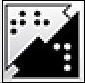
OR right-click and Select Change Translation.

\# Select the appropriate translation for your document:

- Uncontracted (Ctrl + Shift + T): Presents the selected text in grade 1
  braille, without the use of contractions. The text is highlighted in
  green in the braille view.
- Direct (Ctrl + D): Presents the literal ASCII translation of the
  selected text. The text is highlighted in purple in the print view.

**Note:** Direct translation is sometimes necessary when you need to
force the translation to appear a certain way, but BrailleBlaster does
not allow it otherwise.

#### Correcting the Braille Translation

Correct Braille Translation allows you to submit translation corrections
for the program LibLouis. This ensures quick and easy recognition of
undefined print characters. The most common corrections are for Unicode
characters (i.e., Unicode: U + 25B6 for a black right-pointing
triangle), proper nouns, and non-English words, though you may find a
translation mistake on occasion.  
When you encounter an undefined Unicode character in the translation,
the Unicode image appears in the Print View, while the Unicode name,
enclosed in Transcriber’s Notes, appears in the Braille View.

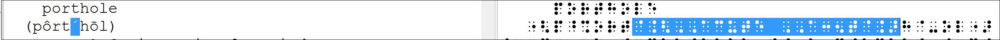

##### Making a Braille Translation Correction

To make a braille translation correction:

1.  In the Print View, highlight the character or word that is not
    translating correctly.
2.  Go to Tools \> Correct Braille Translation OR use the keyboard
    shortcut (Ctrl + T). In the Correct Translation window the
    highlighted print word is shown in the Print textbox. There is also
    a Braille textbox for entering the correct translation of the
    character or word.


{{html

<ol>

<li value=3>

Choose one of three options appropriate to the correction of the text:

</li>

</ol>

}}

Define New Character: Creates a new character.

Correct Character: Corrects an improperly translated character.

Correct Word: Corrects a proper noun or foreign word.

{{html

<ol>

<li value=4>

Select your entry method for typing the correct braille: Six Key or
ASCII.

</li>

<li>

Type the corrected braille into the Braille textbox.

</li>

<li>

Select one of two options for saving your translation correction or
Cancel to leave without making changes:

</li>

</ol>

}}

Save Translation Locally: Allows you to save to a locally designated
file on your computer. This option is for personal translation options.

Save Translation Globally: Saves to a local file on your computer and
submits the correction to APH. APH reviews the change for future
BrailleBlaster releases and to share with others who use LibLouis. This
process of continuous improvement to the translation tables helps
braille readers around the world receive timely, accurate braille.

##### Viewing Past Braille Translation Corrections

To view past braille translation corrections:

1.  Select the View Corrections button at the bottom of the Correct
    Translation window. This action opens another window where your
    corrections to translations can be viewed.

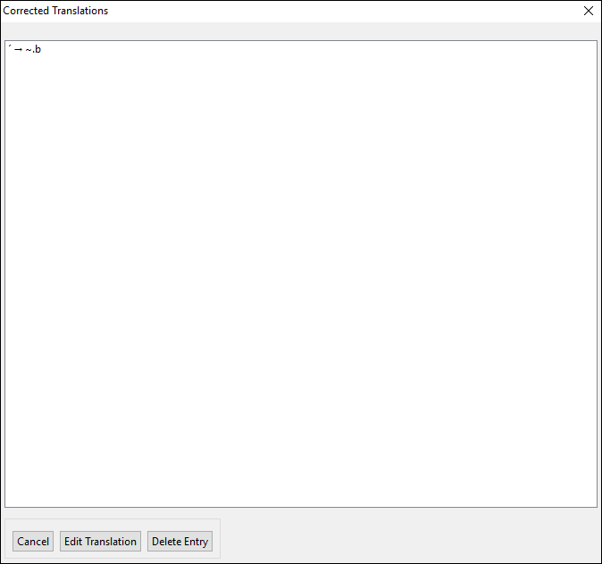

{{html

<ol>

<li value=2>

Select the Edit Translation button to make edits to translations you
have previously entered OR select a translation from the list and click
the Delete Entry button to delete translations that are no longer
needed.

</li>

<li>

Select Cancel to return to the Correct Braille Translation window
without making any changes.

</li>

</ol>

}}

### Finding and Replacing Text and Styles

The Find and Replace tool allows you to find and edit text and
formatting easily.

#### Finding Text

To find text in your document:

1.  Go to Edit \> Find and Replace OR use the keyboard shortcut (Ctrl +
    F).
2.  Type the text you want to search for into the Find Text textbox.


{{html

<ol>

<li value=3>

(Optional step) Select one or both options to narrow down the search:

</li>

</ol>

}}

- Match Case: Only searches for the text as you type it in regard to
  capitalization.  
  **Example:** If you search for “THE” with Match Case checked,
  BrailleBlaster only finds instances of the fully capitalized
  characters “THE” and ignores any others, like “The” or “the.”

<!-- -->

- Whole word: Only searches for instances of the text that are preceded
  and followed by a space, rather than instances of the characters
  within a longer word.  
  **Example:** If you search for “the” with Whole word checked,
  BrailleBlaster only finds instances of “the” where it stands alone as
  a word, and ignores results like “theater,” “them,” “bathe,” and so
  on.

{{html

<ol>

<li value=4>

Select the Find button to search for an instance of the text. The text
is highlighted in the Print View of your document for further instances
of the text.

</li>

<li>

(Optional step) Continue using the Find button to cycle through the
document. You can also cycle through the document forwards or backwards
by selecting one of those options.

</li>

<li>

Select Close when finished.

</li>

</ol>

}}

#### Replacing Text

To replace text in your document:

\# Go to Edit \> Find and Replace OR use the keyboard shortcut (Ctrl +
F).

\# Type the text you want to replace into the Find textbox.

\# (Optional step) If appropriate, check the Match Case or Whole Word
checkboxes.

- Match Case: Only searches for the text as you type it in regard to
  capitalization.  
  (Optional step) Check the Match case checkbox to maintain the
  capitalization of the original text.  
  **Example:** If you enter “even” in the Find Text box and “odd” in the
  Replace with box with Match case checked, “even” is replaced with
  “odd,” “Even” is replaced with “Odd,” and “EVEN” with “ODD.”  
  **Note:** Match case only works with lowercase, all uppercase, and
  initial case but not with camel-capped words or oddly capped words
  (e.g., BrailleBlaster or BrAiLLeBlASTer).
- Whole Word: Only searches for instances of the text that are preceded
  and followed by a space, rather than instances of the characters
  within a longer word.  
  **Example:** If you search for “the” with Whole Word checked,
  BrailleBlaster only finds instances of “the” where it stands alone as
  a word, and ignores results like “theater,” “them,” “bathe,” and so
  on.

{{html

<ol>

<li value=4>

Type the replacement text in the Replace With textbox.

</li>

<li>

Select the Find button to search for instances of the text.

</li>

<li>

Select the Replace button to replace that instance of text in the Find
box.

</li>

</ol>

}}

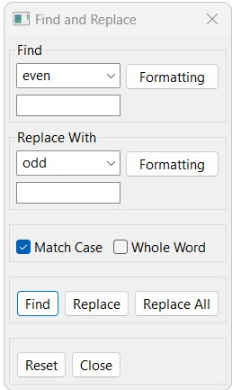

{{html

<ol>

<li value=7>

Pressing Replace again moves you to the next instance of the word in the
Find box and pressing it once more replaces the text. You can continue
that way, OR you can select Replace All, changing ALL of the instances
at once without clicking through each one.

</li>

<li>

Select Close when you are finished.

</li>

</ol>

}}

#### Finding Formatted Text

In addition to changing text through the Find and Replace function, the
formatting on text can also be located using the Formatting button in
the Find and Replace window.

To find formatted text:

1.  Go to Edit \> Find and Replace OR use the keyboard shortcut (Ctrl +
    F).
2.  Click Formatting to open the types of Formatting for Find and for
    Replace.

The three types of formatting that can be changed are:

- Styles: Focuses on Styles of text and margins.
- Containers: Focuses on other boxes of text such as a box or full color
  box.
- Text Attributes: Focuses on Emphasis and Translation of text.

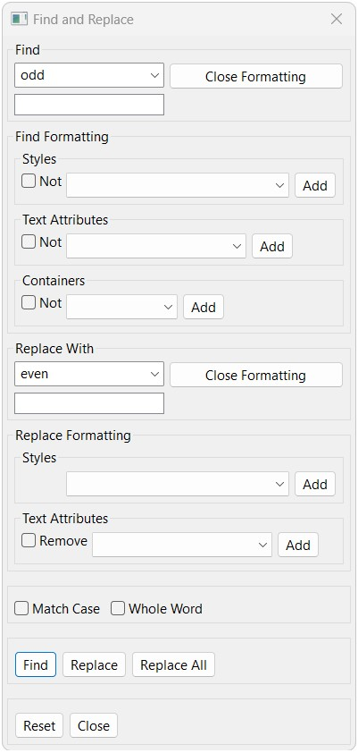

The three options have an Add button and Not radio buttons.

- Add: Only finds the text you typed if it has the selected
  formatting.  
  **Example:** If you add “Heading 1” to the Find box, your search only
  finds the word “The” if it appears within a Heading 1 style and
  ignores all other instances.

<!-- -->

- Not Radio Buttons: The behavior of the Not button is a little more
  complicated. It finds all instances of the text unless it has the
  selected formatting.  
  **Example:** If you remove “Heading 1” to the Find box, it appears as
  “Not Heading 1,” and search for all instances of “The” that are not
  within Heading 1 styles.

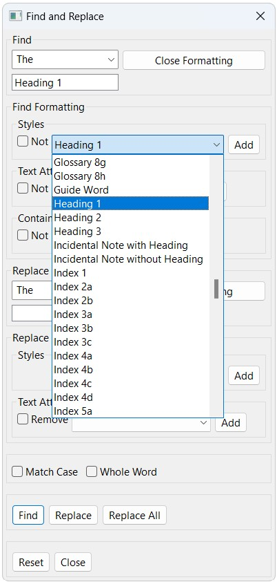

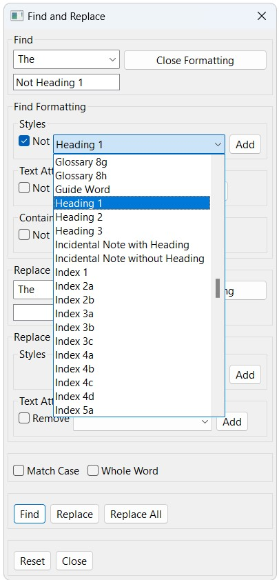

{{html

<ol>

<li value=3>

Styles, Containers, and Text Attributes each have lists of options.
Select whatever Formatting is appropriate.

</li>

<li>

Click Add to add Styles, Containers or Text Attributes to the Find box.

<p>

This action adds the selected item to the textbox under Find. If you
decide you do not want an item included in your Formatting, select Reset
to clear the Find box.

</p>

</li>

</ol>

}}

**Note:** Only one style can be added or removed at a time. Clicking a
different style and then the Add button only changes the style selected
in the text box.

{{html

<ol>

<li value=5>

Click Close Formatting to return to the Find and Replace window.

<p>

The Formatting you have selected now appears in a text box under Find
Text.

</p>

</li>

<li>

When finished, click Close to exit the Find and Replace window.

</li>

</ol>

}}

#### Replacing Formatted Text

To replace formatted text:

\# Go to Edit \> Find and Replace OR use the keyboard shortcut (Ctrl +
F).

\# Click Formatting to open the Formatting window.  
The two options of formatting that can be changed are:

- Styles: Focuses on Styles of text and margins.
- Text Attributes: Focuses on Emphasis and Translation of text.

Both options have the Add button. Only Text Attributes has the Remove
Radio button.

- Add: Adds the selected format to any instances of the specified text
  in the Find and Replace window.  
  **Example:** If you add “Heading 1” to the Replace box, your search
  replaces the formatting of every instance of “The” to be within the
  Heading 1 style.

<!-- -->

- Remove: You cannot remove a style, but you can replace it. You
  indicate the style you are looking in Find and the style you are
  replacing with in Replace.

{{html

<ol>

<li value=3>

Styles and Text Attributes have lists of options. Select whatever
Formatting is appropriate.

</li>

<li>

Click on the Add button to add the Styles or Text Attributes to the
Replace box.

<p>

This action adds the selected item to the textbox under Replace. If you
decide you do not want an item included in your Formatting, select Reset
to clear the Replace box.

</p>

<p>

Note: Only one style can be added or removed at a time. Clicking a
different style and then the Add button simply replaces the style
selected in the bottom text box.

</p>

</li>

<li>

Select Done to return to the Find and Replace window.

<p>

The Formatting you have selected now appears in a text box under Replace
with.

</p>

</li>

<li>

When finished, click Close to exit the Find/Replace window.

</li>

</ol>

}}

#### Resetting Find and Replace

Click Reset to clear all selected formatting options and checkboxes. The
most recently searched text remains in the Find Text and Replace with
fields.

#### Repeating the Last Search

Repeat Last Search lets you repeat what you have searched for even after
closing Find and Replace.

To repeat the last search, Go to Edit \> Repeat Last Search OR use the
keyboard shortcut (F3).

This action searches the document for the last searched item from Find
and Replace and highlights it in the Print View. It does not open the
Find and Replace window or make any changes.

**Note:** Continuing to use Repeat Last Search cycles you through the
document. If your last search also included Replace information, your
text is replaced when you move to the next item.

### Operations Specific To NIMAS Files

Since BrailleBlaster is intended to work hand in hand with XML and NIMAS
files, there are some tools in BrailleBlaster that are designed to work
with this file type only.

#### Using Publisher’s Production Notes

The Production Note Manager is a tool that was designed to manage
production notes. Production notes are added by the publisher and are
meant to assist with the physical production of the textbook. There are
many different kinds of production notes and some are useful in the
braille transcription process, while others are not. The Production Note
Manager lets you view these notes and decide which notes you would like
to Keep, Hide, or Remove.

To keep, hide, or remove production notes:

1.  Go to Tools \> Production Note Manager.
2.  A window opens listing the publisher’s notes. Choose one of three
    options:


- Keep: While production notes are not usually found in the actual print
  book, there is a chance that the text has been improperly labeled or
  is a useful picture description. Select the Keep option to keep the
  production note in the braille.
- Hide: Selected as the default for all production notes, Hide removes
  them from the braille translation but keeps them in the file so they
  can be referenced in future versions that might not be meant for
  braille.
- Remove: Removes production notes entirely by deleting them from the
  file. This is not recommended as they are not recoverable after this
  action is taken.

**Note:** You can also choose options that affect all production notes,
depending on what you need in your file: Keep All, Hide All, or Remove
All.

{{html

<ol>

<li value=3>

Click Apply to save your choice OR Cancel to leave the window.

</li>

</ol>

}}

#### Navigating A NIMAS File

The Book Tree allows navigation through NIMAS files via a list of nested
headings. It shows the defined section levels listed in the NIMAS file.


To navigate using the Book Tree:

1.  Go to Navigate \> Book Tree.
2.  To display and navigate through ALL of the levels in ALL of the
    sections, select the right-facing arrow to the left of the file
    name.
3.  Select the section you want to navigate to and choose the Navigate
    button at the bottom of the window.
4.  Select Close to cancel the navigation action.

## Glossary

**ASCII:** Stands for the American Standard Code for Information
Interchange but it is simplest to think of it as the print symbols that
can be created by a keyboard.

**Book Tree:** The Book Tree is similar to a table of contents, showing
the hierarchy of the book’s material. Although it does not show you the
page numbers, selecting a section takes you to that page in the file.
NIMAS files can be navigated using the Book Tree, which shows the
Section tags and headings applied by the publisher.

**Breadcrumb:** The breadcrumbs feature shows different levels of styles
applied to a piece of text. They are visible in the bottom section of
the toolbar and show any containers and section tags. Clicking on one of
the levels shown within the breadcrumbs highlights the section of text
it applies to in the print view.  
**Note:** When using a screen reader while breadcrumbs is active, any
change to the breadcrumbs is read. You can turn breadcrumbs off by going
to View \> Toggle Views \> Breadcrumbs.

**Close** (Ctrl + W): Closes the current document, but BrailleBlaster
(and any other documents) remains open. Clicking the X in the tab above
the print view where the file name appears (or New Document if you
haven’t saved it with a new name yet) has the same result—closing only
that document.

**Container:** BrailleBlaster automatically views some styles as being
kept in a container, including List, Poetry, and Boxes. The word
CONTAINER appears before the style name in the breadcrumbs, and when
clicked, selects all of the elements with that particular style
contained in the container. Once selected, you can select \[\[#Removing
a Style\|Unwrap Element\]\] from the tools menu to remove that style
from the highlighted text, returning it to body text (3-1 margins). You
can also search for particular containers in \[\[#Finding and Replacing
Text and Styles\|Find and Replace\]\].

**Element:** Each section of text with a style applied to it is
considered an element in BrailleBlaster. For example, every individual
paragraph of Body Text or every individual line of a Poem is considered
an element. You can navigate through each element, as described in
\[\[#Navigating Through Text Elements\|Navigating Through Text
Elements\]\] to review the formatting.

**Exit** (Alt + F4): Closes the BrailleBlaster application, including
any open documents but giving an opportunity to save if changes have
been made.

**Loadouts:** Loadouts allow you to create shortcut keys for styles.
There are not enough shortcut key combinations available for every style
in BrailleBlaster. As an alternative, you can configure the loadout to a
particular style type and designate the style levels (as appropriate) to
quickly change the formatting of your text, using shortcut keys rather
than clicking with the mouse. See \[\[#Configuring Style
Loadouts\|Configuring Style Loadouts\]\] for more information.

**Set Cell Position:** Sets the indentation position of the text at your
chosen curser position. A dialog box opens in which you can type the
cell number where the text at the cursor should start. If you type in a
number lower than the cell the text is currently on, it moves to the
next line and begins in that cell. It does not work if the cursor is at
the end of a line.

**Spell Check** (F7): Reviews the print document for spelling errors.
There are many options within Spell Check to make changes to the errors
found:

- Add to Dictionary: Adds the word to the dictionary so that it is no
  longer considered a spelling error in the current document and future
  documents.
- Ignore Word: Ignores the misspelled word and any other time it appears
  in the current document.
- Replace: Replaces the selected instance of the word with a suggested
  word from the list or with a word you type into the textbox.
- Replace All: Replaces all instances of the word within the document
  with a suggested word from the list or with a word you type into the
  textbox.
- Skip: Makes no change to the word and moves on to the next misspelled
  word. BrailleBlaster continues to recognize the word a spelling error,
  should you use Spell Check again.

**Styles:** Styles impact the margins of the braille and the use of
blank lines in your document. BrailleBlaster uses many different
“styles” to convey to the braille reader how the print is formatted. The
default layout of BrailleBlaster shows the style view on the left, so
that the name of the style is in line with the corresponding print to
the right. The complete detailed list of styles are found in the
\[\[#Appendix A: Formatting Styles\|Appendix A: Formatting Styles\]\].  
**Note**: An asterisk next to a style name in the Style view represents
an image in that element. More details are in the \[\[#Describing Images
with the Image Describer\|Describing Images with the Image Describer\]\]
section.

**TOC Builder:** The tool used to build the Table of Contents (TOC).
Complete instructions on using this feature are available in
\[\[#Building the Table of Contents (TOC)\|Building the Table of
Contents\]\].  
Toggle: Turns something on or off. For example, clicking View \> Toggle
Views \> Breadcrumbs turns off the Breadcrumbs, removing them from the
toolbar. Clicking View \> Toggle Views \> Breadcrumbs a second time
turns them on, putting them back on the toolbar.

## Help

Like any new software program, it is possible to run across some
problems in BrailleBlaster from time to time. There are many tools in
the program for reporting these errors as well as instructions on how to
use the program more effectively.

### Using the Help Menu

The Help menu in BrailleBlaster covers several areas. Some things you
can use Help for include:

- Access a local copy of the BrailleBlaster User Guide OR use the
  keyboard shortcut (F1).
- Check for Updates, for the most up-to-date version of the program.
- Find which version of BrailleBlaster you are using, which is helpful
  for reporting errors to APH staff.
- Open the BrailleBlaster website to find additional information.
- Report errors with View Log or Reset BB.

### Reporting BrailleBlaster Issues

Sometimes, BrailleBlaster has exceptions that appear when specific
strings of actions are performed that the program cannot render,
resulting in an error. If an exception occurs, the most effective way to
solve it is to revert to your most recent save and try making the
changes again.

One of the most important things to do if an exception happens is to
report it with the Exception Reporting Service. Please help improve
BrailleBlaster for other users by taking advantage of this feature. When
an exception pop-up appears, send the exception to APH with the Tell APH
About This Error So They Can Fix It button, or click OK to close the
exception. We encourage you to report these exceptions rather than
dismiss them so BrailleBlaster continues to improve.

View Log and Reset BB are both tools that can be found in the Help menu
to report other potential BrailleBlaster errors. View Log provides the
ability to view or save a software error log in the event that
BrailleBlaster encounters an unexpected problem. This log can be
provided to the technical support staff at APH to assist them in
troubleshooting.  
Reset BB is included with early releases because of potential conflicts
that can occur when updating the program. If documents do not open after
updating, but the previous version of BrailleBlaster worked fine, it is
likely the cause of one of these conflicts.

**CAUTION:** The Reset BB feature deletes all user data, which includes
changes to the translation, page settings, and font size. It is not
recommended to use this feature unless first instructed to do so by an
APH employee.

## Appendix A: Formatting Styles

Style menu items are found both in the Styles menu and as buttons on the
toolbar.

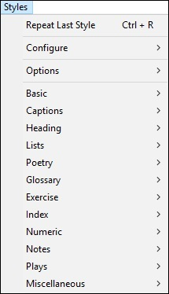

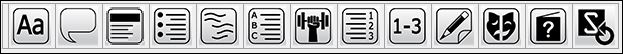

There are many Style options BrailleBlaster supports that are accessed
from the buttons on the toolbar or from the Styles menu. Refer to
[Braille Formats,
2016](http://www.brailleauthority.org/formats/formats2016.html) for
further instruction on when to use each style.

Margins are presented as a hyphenated number with the indent listed
first and the runover second. For example, a list item (which is in 1-3)
has an indent of 1 and a runover of 3. In other words, the first symbol
of the element with this style appears in cell 1, and if a second line
is needed, that line and all subsequent lines begin in cell 3.

### Basic Styles

These styles include some of the simple styles common to transcription.


#### Basic Styles Specification Table

| Style Name | Description | Margins | Blank Line |
|----|----|----|----|
| Blocked Text | Left justified paragraph | 1-1 | Before |
| Body Text | Indented paragraph (default) | 3-1 | None |
| Centered Text | Text centered on the page | Variable | None |
| Displayed 3-5 | Multiple displayed sentences following blocked text (1-1) or body text (3-1) | 3-5 | Before and After |
| Displayed Blocked Text | Displayed blocked paragraph following blocked text (1-1) | 3-3 | Before and After |
| Displayed Body Text | Displayed indented paragraph following body text (3-1) | 5-3 | Before and After |

### Numeric Styles

Numeric styles apply the margins selected based the indentation of the
first cell of text and the runover position used with no additional
formatting. They are arranged in submenus based on the indentation,
ranging from 1 to 11.


#### Numeric Styles Specification Table

| Style Name | Description | Margins | Blank Line |
|----|----|----|----|
| 1-1 | Text begins in cell 1 with runovers in cell 1 | 1-1 | None |
| 1-3 | Text begins in cell 1 with runovers in cell 3 | 1-3 | None |
| … | … | … | … |
| 11-9 | Text begins in cell 11 with runovers in cell 9 | 11-9 | None |
| 11-11 | Text begins in cell 11 with runovers in cell 11 | 11-11 | None |

### Heading Styles

These styles follow the hierarchy of headings according to [Braille
Formats,
2016](http://www.brailleauthority.org/formats/formats2016.html). For
details on inserting a Running Head, see \[\[#Setting a Running
Head\|Setting a Running Head\]\].


#### Heading Styles Specification Table

| Style Name | Description | Margins | Blank Line |
|----|----|----|----|
| Heading 1 | Main heading (Centered Heading - First Level) | Variable | Before & After |
| Heading 2 | Subheading (Cell 5 Heading - Second Level) | 5-5 | Before |
| Heading 3 | Subheading (Cell 7 Heading - Third Level) | 7-7 | Before unless immediately following a Heading 2 |

### List Styles

List styles are arranged in submenus based on the number of levels
within the list, ranging from 1 to 5. Each style begins with the word
List followed by the number for each level within the list. After the
number there is a letter indicating the separate margins in each level.
BrailleBlaster automatically moves entries within a list to immediately
follow one another, and includes a blank before the first list entry and
after the last entry.


#### List Styles Specification Table

| Style Name | Description | Margins | Blank Line |
|----|----|----|----|
| List 1 | List with 1 level | 1-3 | Before & After all 1 level list entries |
| List 2a | First level in a list with 2 levels | 1-5 | Before & After all 2 level list entries |
| List 2b | Second level in a list with 2 levels | 3-5 | Before & After all 2 level list entries |
| … | … | … | … |
| List 5d | Fourth level in a list with 5 levels | 7-11 | Before & After all 5 level list entries |
| List 5e | Fifth level in a list with 5 levels | 9-11 | Before & After all 5 level list entries |

### Exercise Material Styles

Exercise styles are arranged in submenus based on the number of levels
within the exercise, ranging from 1 to 5. Each style begins with the
word Exercise followed by the number for each level within the exercise.
After the number there is a letter indicating the separate margins in
each level. For example, an exercise that is only an open-ended question
has one level, while a question with answer choices has two levels. See
[Braille Formats, 2016 Section
10](http://www.brailleauthority.org/formats/formats2016.html) for more
information.

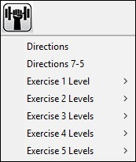

#### Exercise Material Styles Specification Table

| Style Name     | Description                               | Margins | Blank Line |
|----------------|-------------------------------------------|---------|------------|
| Directions     | First paragraph of unnumbered directions  | 5-5     | None       |
| Directions 7-5 | Second paragraph of unnumbered directions | 7-5     | None       |
| Exercise 1     | Exercise with 1 level                     | 1-3     | None       |
| Exercise 2a    | First level in an exercise with 2 levels  | 1-5     | None       |
| Exercise 2b    | Second level in an exercise with 2 levels | 3-5     | None       |
| …              | …                                         | …       | …          |
| Exercise 5d    | Fourth level in an exercise with 5 levels | 7-11    | None       |
| Exercise 5e    | Fifth level in an exercise with 5 levels  | 9-11    | None       |

### Poetry Styles

Poetry styles are arranged in submenus based on the number of levels
within the poem, ranging from 1 to 5. Each style begins with the word
Poetry followed by the number for each level within the poem. After the
number there is a letter indicating the separate margins in each level.
For information about line numbered poetry, see \[\[#Line
Numbering\|Line Numbering\]\].

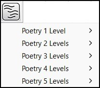

#### Poetry Styles Specification Table

| Style Name | Description                          | Margins | Blank Line |
|------------|--------------------------------------|---------|------------|
| Poetry 1   | Poem with 1 level                    | 1-3     | None       |
| Poetry 2a  | First level in a poem with 2 levels  | 1-5     | None       |
| Poetry 2b  | Second level in a poem with 2 levels | 3-5     | None       |
| …          | …                                    | …       | …          |
| Poetry 5d  | Fourth level in a poem with 5 levels | 7-11    | None       |
| Poetry 5e  | Fifth level in a poem with 5 levels  | 9-11    | None       |

### Caption Styles

The style caption does not include transcriber’s notes indicators. These
need to be added to captions, when appropriate.

Transcriber’s Notes are automatically applied to all descriptions. For
this reason, the entire item must be highlighted before applying style
so that TN symbols are applied in the correct location.

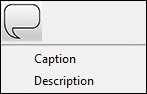

#### Caption Styles Specification Table

| Style Name | Description | Margins | Blank Line |
|----|----|----|----|
| Caption | Print provided caption for illustrative materials | 7-5 | None |
| Description | Transcriber generated description for illustrative materials | 7-5 | None |

### Glossary Styles

Glossary styles are arranged in submenus based on the number of levels
within the glossary, ranging from 1 to 5. Each style begins with the
word Glossary followed by the number for each level within the glossary.
After the number there is a letter indicating the separate margins in
each level. Typically, the publisher has identified the term and the
definition within the file, allowing the term to be used as a Guide Word
automatically. See \[\[#Working with Alphabetic References\|Working with
Alphabetic References\]\] for more information.


#### Glossary Styles Specification Table

| Style Name  | Description                              | Margins | Blank Line |
|-------------|------------------------------------------|---------|------------|
| Glossary 1  | Glossary with 1 level                    | 1-3     | None       |
| Glossary 2a | First level in a glossary with 2 levels  | 1-5     | None       |
| Glossary 2b | Second level in a glossary with 2 levels | 3-5     | None       |
| …           | …                                        | …       | …          |
| Glossary 5d | Fourth level in a glossary with 5 levels | 7-11    | None       |
| Glossary 5e | Fifth level in a glossary with 5 levels  | 9-11    | None       |

### Index Styles

Index styles are arranged in submenus based on the number of levels
within the index, ranging from 1 to 5. Each style begins with the word
Index followed by the number for each level within the index. After the
number there is a letter indicating the separate margins in each level.
See \[\[#Working with Alphabetic References\|Working with Alphabetic
References\]\] for more information.


#### Index Styles Specification Table

| Style Name | Description                            | Margins | Blank Line |
|------------|----------------------------------------|---------|------------|
| Index 1    | Index with 1 level                     | 1-3     | None       |
| Index 2a   | First level in an index with 2 levels  | 1-5     | None       |
| Index 2b   | Second level in an index with 2 levels | 3-5     | None       |
| …          | …                                      | …       | …          |
| Index 5d   | Fourth level in an index with 5 levels | 7-11    | None       |
| Index 5e   | Fifth level in an index with 5 levels  | 9-11    | None       |

### Note Styles

The styles for notes include those for footnotes (BF 2016 Section 16),
but this style can also be used for endnotes and notes to a simple
table, as they have the same margins. If a footnote has multiple
paragraphs, the second paragraph needs to be formatted separately in
5-3. If the note is for a table which is presented in a listed, linear,
or stairstep format, do not use the Footnote style (1-3) as these should
have 7-5 margins. Designating text as a footnote only adjusts the
margins; it does not insert the note separation line or move the text to
the bottom of the print page.

To insert the Note Separation line:

1.  The Note Separation Line appears after the text element where your
    cursor is placed, meaning you must place your cursor at the end of
    the text previous to the footnote. If your cursor is at the
    beginning of the footnote, the Note Separation Line appears after
    the footnote.
2.  Go to Insert \> Note Separation Line.
3.  The Note Separation Line appears as the ASCII in the print view.

Incidental notes, with and without a heading, can also be used for cross
references as they have the same margins (BF 2016 Section 9.6).

**Incidental Note without a Heading** can also be used for footnotes to
a listed, linear, or stairstep table, and for speaker’s notes in a slide
presentation. If the Incidental note has a heading, it needs to be
designated separately as a cell-7 heading.

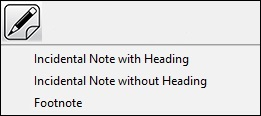

#### Note Styles Specification Table

| Style Name | Description | Margins | Blank Line |
|----|----|----|----|
| Incidental Note with Heading | Incidental note or cross-reference with a heading | 5-5 | Before & After |
| Incidental Note without a Heading | Incidental note or cross-reference without a heading | 7-5 | Before & After |
| Footnote | Footnote that appears at the bottom of the print page, footnote to a table, or endnote | 1-3 | None |

### Play Styles

Plays are formatted according to their type. There are two types of
plays: Prose and Verse. A prose play is written in paragraph format,
while Verse appears like poetry in print (BF 2016 Section 13).


#### Play Styles Specification Table

| Style Name | Description | Margins | Blank Line |
|----|----|----|----|
| Prose Play 1-3 | The first paragraph by a speaker in a prose play | 1-3 | None |
| Prose Play 5-3 | Additional paragraphs immediately following the first by the same speaker in a prose play | 5-3 | None |
| Stage Directions 7-7 | The first paragraph of stage directions in a prose or verse play | 7-7 | None |
| Stage Directions 9-7 | Additional paragraphs immediately following the first paragraph of stage directions in a prose or verse play | 7-9 | None |
| Verse Play 1-5 | The first line by a speaker in a verse play | 1-5 | None |
| Verse Play 3-5 | Additional lines immediately following the first by the same speaker in a verse play | 3-5 | None |

### Miscellaneous Styles

This selection of style elements include those that do not fit into
other categories.

It includes the Transcriber’s Notes styles and Box styles. Note that
these styles are special and require the user to select the entire set
of text to which they will be applied first. Since the transcriber’s
note style adds the transcriber’s note symbols and the box styles add
box lines, the program must know where the user wants those to appear
and it learns this through the selection made by the user.

#### Miscellaneous Styles Specification Table

| Style Name | Description | Margins | Blank Line |
|------------|-------------|---------|------------|

|  |  |  |  |
|----|----|----|----|
| Transcriber’s Note | Each paragraph of selected text is enclosed in transcriber’s note indicators | 7-5 | None |

#### Boxes Options Specification Table

Within the Miscellaneous Styles are several options for Boxes.

<table>
<thead>
<tr>
<th>Style Name</th>
<th>Description</th>
<th>Blank Line</th>
</tr>
</thead>
<tbody>
<tr>
<td>Box</td>
<td>Selected text appears within a top and bottom box line</td>
<td>Before the top box line &amp; After the bottom box line</td>
</tr>
<tr>
<td>Color Box</td>
<td>Selected text appears within a top and bottom box line, and the
color you type in the pop-up appears within<br />
transcriber’s notes on the top box line</td>
<td>Before the top box line &amp; After the bottom box line</td>
</tr>
<tr>
<td>Full Box</td>
<td>Selected text appears within a top and bottom full box line<br />
(the exterior borders for a set of nested boxes)</td>
<td>Before the top box line &amp; After the bottom box line</td>
</tr>
<tr>
<td>Full Color Box</td>
<td>Selected text appears within a top and bottom full box line (the
exterior borders for a set of nested boxes),<br />
and the color you type in the pop up window appears within transcriber’s
notes on the top full box line</td>
<td>Before the top box line &amp; After the bottom box line</td>
</tr>
</tbody>
</table>

## Appendix B: Shortcut Key Combinations

| Key Combination | Description |
|----|----|
| FILE OPERATIONS |  |
| CTRL + N | Create a new document |
| CTRL + O | Open a document |
| CTRL + W | Close a document |
| ALT + F4 | Quit BrailleBlaster |
| CTRL + S | Save the document |
| CTRL+SHIFT+S | Save the document in a custom location |
| CTRL + P | Print a document |
| CTRL + E | Emboss a document |
| ALT + HOME | Open the Braille Preview |
| SHIFT + F10 | Open the context menu (same action as when you right click) |
| CTRL + + | Increase font size 1 point |
| CTRL + - | Decrease font size 1 point |
| EDITING |  |
| CTRL + Z | Undo the last action |
| CTRL + Y | Redo the last action |
| CTRL + X | Cut the selected text |
| CTRL + C | Copy the selected text |
| CTRL + V | Paste copied text |
| CTRL + F | Open the find/replace pane |
| F3 | Repeat the last search |
| SHIFT + ENTER | Insert Line Break |
| CTRL + ENTER | Insert Page Break |
| CTRL + 5 | Convert text to Print Page Number |
| F7 | Spell check |
| CTRL + SPACE | Insert non-breaking space (represented as a white rectangle with a black outline in the print view) |
| CTRL + R | Repeat last style applied |
| CTRL + T | Correct Braille translation |
| ALT + X | Six-Key Mode |
| CTRL + M | Math Translation Toggle |
| CTRL + D | Direct Translation |
| CTRL + SHIFT + T | Uncontracted Translation |
| CTRL + F2 | Wrap Prose |
| CTRL + SHIFT + F2 | Edit Line Number |
| NAVIGATION |  |
| ALT + P | Toggle Print View |
| CTRL + G | Open the page selection options |
| CTRL + HOME | Go to the first page of the current document |
| CTRL + END | Go to the last page of the current document |
| ALT + END | Open the Book Tree |
| CTRL + Down | Go to the Next Element |
| CTRL + Up | Go to the Previous Element |
| Page Up | Next Page |
| Page Down | Previous Page |
| TYPEFORMS |  |
| CTRL + B | Bold |
| CTRL + I | Italic |
| CTRL + U | Underline |
| ALT + SHIFT + S | Script |
| SHIFT + ALT + 1 | Transcriber-Defined Typeform 1 |
| SHIFT + ALT + 2 | Transcriber-Defined Typeform 2 |
| SHIFT + ALT + 3 | Transcriber-Defined Typeform 3 |
| SHIFT + ALT + 4 | Transcriber-Defined Typeform 4 |
| SHIFT + ALT + 5 | Transcriber-Defined Typeform 5 |
| LOADOUTS |  |
| CTRL + SHIFT + M | Set Miscellaneous style loadout |
| CTRL + SHIFT + B | Set Basic style loadout |
| CTRL + SHIFT + C | Set Caption style loadout |
| CTRL + SHIFT + H | Set Heading style loadout |
| CTRL + SHIFT + L | Set Lists style loadout |
| CTRL + SHIFT + P | Set Poetry style loadout |
| CTRL + SHIFT + A | Set Plays style loadout |
| CTRL + SHIFT + G | Set Glossary style loadout |
| CTRL + SHIFT + E | Set Exercise Material style loadout |
| CTRL + SHIFT + I | Set Index style loadout |
| CTRL + SHIFT + U | Set Numeric style loadout |
| CTRL + SHIFT + N | Set Notes style loadout |
| ALT + NUMBER 1-8 | Apply the style level corresponding to that number for the current loadout |
| MISCELLANEOUS |  |
| F1 | Open Braille Blaster User Guide |

## Appendix C: Troubleshooting Embosser Issues

If you encounter issues with the embossed output when embossing a
document, please follow the below steps.

### Confirm Correct Embosser Configuration

In your embosser configuration in BrailleBlaster check that the
manufacturer and model settings exactly match the embosser you are
using. Embossers with similar model names may interact with
BrailleBlaster in very different ways, so it is important that you
select the exact model.

### Try Using Generic Text Embosser Support

If your embosser model is not listed in BrailleBlaster, or embossing
does not work correctly when you select your specific embosser model,
then try the generic text embossing support. Go to Settings \> Embosser
settings, select your embosser configuration and press the edit button.
In your embosser configuration in BrailleBlaster select “Generic” for
the manufacturer and “Text only” for model.

When changing to generic text embosser support, it is important you
correctly configure your embosser’s internal settings for the paper size
and margins for the document you want to emboss. This will be done by
using software provided by your embosser’s manufacturer or by using the
buttons on the embosser itself. For details on how to alter your
embosser’s internal settings, please refer to the user guide for your
embosser.

### Tweak Advanced Embosser Options

If generic text embosser support has not resolved your embossing issue,
then it is possible to adjust how generic text embossing support works  
by altering the advanced embosser options. The values to be used depends
upon the embosser being used, below is some information about the
different options and some recommended values for some embosser models.

#### Advanced embosser options

- Add margins: Whether BrailleBlaster should insert spaces and new lines
  in the embossed output to emulate the margins. If you set this to
  true, then your embosser should expect the lines to be longer than the
  Braille and the number of lines per page to be greater to account for
  the margins. It is recommended to set this to false and configure
  margins in your embosser’s internal settings.
- Pad page: When set to true, for pages which do not have all lines used
  by Braille, BrailleBlaster will insert new line characters for each
  empty line at the end of the page. This option is most useful for
  embossers which do not use form feed characters to identify new pages
  and instead rely on counting number of lines. For most embossers you
  should set this to false.
- Form feed on full page: Whether BrailleBlaster should insert the form
  feed sequence at the end of a full page. For most embossers this
  should be set to false.
- End of line: The byte sequence for the end of the line. For most
  embossers set this to \r\n but for some embossers \n may be required.
  See the below list of embossers for embosser specific recommendations.
- End of page: The byte sequence for the end of a page. For many
  embossers this should be set to \f however some models may need a
  different value, see the below embosser specific recommendations.
- Header: A byte sequence which will be sent to the embosser before the
  Braille. This may be useful if your embosser needs a sequence of bytes
  to configure a mode/setting or simply state the start of an emboss
  job. In most cases it is recommended to keep this empty.
- Footer: A byte sequence to be sent at the end of a emboss job. For
  most embossers this should be left blank, however some embossers do
  require a value, see the below embosser specific list for details.

#### Embosser specific recommended values

##### Enabling Technologies

| Model             | End of line | End of page | Footer |
|-------------------|-------------|-------------|--------|
| Phoenix Gold      | \r\n        | \r\n\f      | \x1a   |
| Phoenix silver    | \r\n        | \\r\n\f     | \x1a   |
| Cyclone           | \r\n        | \r\n\f      | \x1a   |
| Trident           | \r\n        | \r\n\f      | \x1a   |
| Book Maker        | \r\n        | \r\n\f      |        |
| Braille Express   | \r\n        | \r\n\f      |        |
| Thomas            | \r\n        | \r\n\f      |        |
| Thomas Pro        | \r\n        | \r\n\f      |        |
| ET                | \r\n        | \r\n\f      |        |
| Juliet Pro60      | \r\n        | \r\n\f      |        |
| Juliet Pro        | \r\n        | \r\n\f      |        |
| Juliet Classic    | \r\n        | \r\n\f      |        |
| Romeo 25          | \r\n        | \r\n\f      |        |
| Romeo Pro50       | \r\n        | \r\n\f      |        |
| Romeo Attache     | \n          | \n\f        |        |
| Romeo Attache Pro | \n          | \n\f        |        |
| Romeo 60          | \r\n        | \f          | \x1a   |
| Juliet 120        | \r\n        | \f          | \x1a   |

##### Index Braille

| Model         | End of line | End of page | Footer |
|---------------|-------------|-------------|--------|
| Basic-D V5    | \r\n        | \f          | \x1a   |
| Basic-D V4    | \r\n        | \f          | \x1a   |
| Everest-D V5  | \r\n        | \f          | \x1a   |
| Everest-D V4  | \r\n        | \f          | \x1a   |
| BrailleBox V5 | \r\n        | \f          | \x1a   |
| BrailleBox V4 | \r\n        | \f          | \x1a   |
| Fanfold V5    | \r\n        | \f          | \x1a   |
